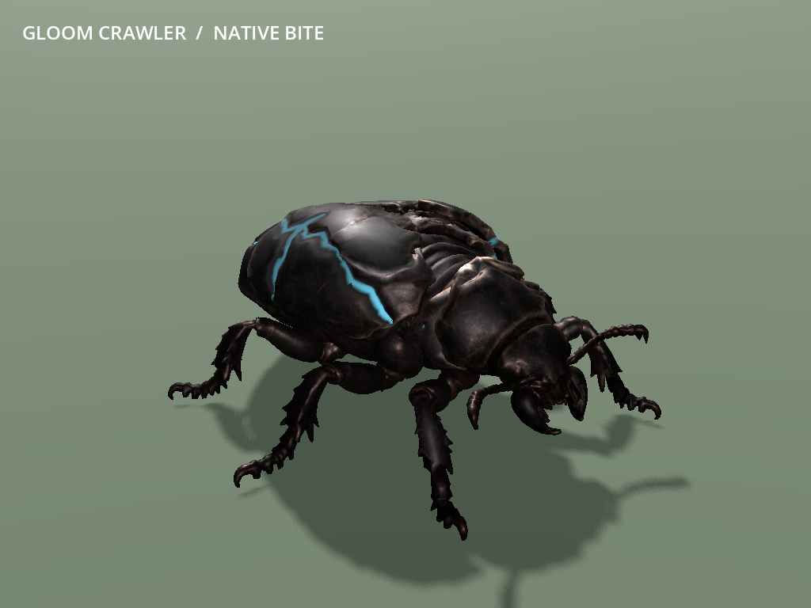

# MOB-04 — playable beetle Gloom Crawler

The approved beetle now replaces the Gloom Crawler in ordinary new worlds and
Continue on main, published as `a524870`. Its 25-bone skin has six fitted jointed legs,
an alternating tripod gait, supported antennae and a short mandibular brace/bite.
The displaced dark elytra, exposed lamellae and recessed travelling lifelines
remain. Normal native pursuit, swarm damage and melee events drive presentation.

**Limits:** the low wide animal differs from the unchanged upright .35 m radius /
1.3 m collider and its contact envelope. Deliberate foot sliding, no terrain IK,
generated fine cavities and simple joint weighting remain prototype limits.
Full performance impact and owner playtesting are deferred. Physical era
additions, remaining mobs and the reported significant underground lag remain
open. Legitimate cave/digging behavior is unchanged; R9 remains stopped.

Standing owner approval covers this integrated prototype slice. This records
implementation and technical checks, not a new claim of hands-on owner review.

## Mainline adoption — 15 September 2026

The completed worker task returned `ebaef881a2623b63b77c6607f4545a0429acaa6e`.
The coordinator cherry-picked it as `a524870` without conflicts. Integrated game
and beetle-tool files match the checked worker commit exactly. The worker's 10
saved-master, 45 native and 14 Continue checks above were reused. One headless
main import passed in **5.23 seconds**, exit 0 and no reported errors; its compact
[result](../../game/tests/mob04/evidence/mainline-import.json) is retained with the
evidence. Logs and private data are in
`D:/Wroughtwild/work/mob04-beetle/build/mob04/mainline-adoption/`.

No new renderer, source rebuild, combat matrix or performance gate was run. The
owned import process exited; no game override or testing was left running. The
ordinary `c4d620f..a524870` push to origin/main succeeded. Existing owner captures
were preserved. Nymph and tortoise remain; underground lag and full performance
impact are still open rather than implied to pass through this art adoption.

## Focused verification

Concrete risks were unsupported/deformed limbs or shell, wrong native timing and
swarm damage, shared instance state, and stale cosmetic attacks after Continue.
Three focused groups were completed on one renderer (Forward+):

| Group | Actual result |
| --- | --- |
| Rig/export and selected saved master | Six fitted three-segment chains, four baked clips, normalized weights and original maps; **10 saved-master checks passed**. Maximum foot-target error 0.0000001891 source units. |
| Import and native actor/capture | Import exit 0 in **35.85 s**, no reported errors. **45 native assertions passed** in **13.52 s**, including the selected motion capture. |
| Ordinary pack/death/Continue | Seed 77 `frontier_v6`, native cave pack, real native death/loot counter and ordinary SaveManager write/read: **14 assertions passed** in **37.0 s**. |

Native assertions cover lone, one-to-five living-neighbour bites, the inclusive
4 m radius and .6 cap, exclusion of dead/non-swarm neighbours, and continued
eligibility of living staggered neighbours. A native release deals the exact
swarm-scaled mitigated hit; reach and solid cover still reject contact. Actual
pursuit, freeze holding exact bones, stagger cancellation, pause, shared reusable
mesh with independent materials/poses, rebind and death pass. No animation deals
damage or changes the native 60 life / 5 physical damage / 5 m/s / 1.5 m range /
.25-second windup, AI, separation, population, drops, IDs or progression.

Continue retains exact native progression, finite-source ownership and the death
loot sequence, selects one beetle rig/observer and clears the unsaved cosmetic
strike. This deterministic death produced no loose pickup; the exact empty
loose-drop snapshot was retained. This is a cave-associated actor fixture and
provides no underground performance measurement.

The early native fixture consumed a random roll while calculating expected
mitigation, then carried cached wall-contact state into pursuit. Fixed the
fixture's seed setup and stationary contact refresh; gameplay code is unchanged.
The first Continue comparison mixed JSON float numbers with in-memory integers;
normalizing both representations preserves complete snapshot equality. Those
failed logs remain in the local build directories. Final logs report zero
script/shader errors and zero failed assertions. WebP coalesced three identical
frames; decoded duration remains exactly nine seconds.

Original ART-06C source identity, incision-depth and texture evidence was reused.
No parent rehash/copy, source regeneration, native rebuild, benchmark, baseline,
renderer matrix or broad campaign review was run. All owned processes exited,
the render mutex was released and the owned `game/override.cfg` was removed.

Compact [native results](../../game/tests/mob04/evidence/native-checks.json),
[Continue results](../../game/tests/mob04/evidence/restore-checks.json),
[saved source check](../../game/tests/mob04/evidence/source-checks.json) and
[rig report](../../game/tests/mob04/evidence/rig-report.json) are committed.
Detailed logs and private saves remain under this worktree's `build/mob04/`.

## Runtime and source handoff

- [Runtime descriptor](../../game/assets/authored/roster/gloom_crawler/asset.json):
  one **79,997-triangle** skinned mesh, 36,704 Blender vertices, one surface,
  25 bones, at most three weights, plus original base/ORM/scar maps.
- [Recipe and reproduction](../../tools/wroughtwild-mob04-beetle/README.md) and
  [fitted joints/visual tuning](../../tools/wroughtwild-mob04-beetle/rig.json).
- Dense editable master: `D:/Wroughtwild/source-art/mob04-beetle/rig-v01/gloom_crawler-rigged.blend`.
  It retains the 293,396-triangle source, fitted runtime mesh, rig, clips and maps.
  Automatic collapse removed three duplicate triangles; this is not manual retopology.
- Immutable five-file ART-06C input and its setup receipt remain at
  `D:/Wroughtwild/source-art/mob04-beetle/input-art06c/`. They were not overwritten.

`BeetlePresentation` reuses FinishedFauna sampling and the ART-06C
`porcupine.gdshader` material math/status priority. A small manifest/CreatureMotion
dispatch selects it. Body/shell support remains rigid; no wing flaps, flight,
leap or burrowing attack is added. No Enemy, native tuning or save code changed.

The GLB is Y-up, **-Z forward**; it needs no ram-style yaw reversal. Uniform
**.72 metres/source unit** and zero ground offset apply before family/elite scale.
Swarm has no humanoid reduction. **1 metre per cosmetic cycle** gives a quick
tripod cadence, explicitly accepting sliding against the actual .144 m source
stride at that scale. The .25-second windup follows the native fraction; the
baked .225-second release fits the existing .22-second cosmetic window. Idle is
4 seconds; walk .8 seconds. The full visual controls and purposes are documented
in the recipe/descriptor. No new gameplay tuning is introduced.

## Normal-game playtest later

```powershell
& 'C:/Users/Matty/Godot/Godot_v4.5-stable_win64.exe' --path 'C:/Users/Matty/Dev/project-wroughtwild/game'
```

1. Choose Continue or a new world; no art/showcase flag is needed.
2. Encounter a native Gloom Crawler. The checked seed-77 V6 cave pack is near
   game coordinates **X 386.5, Y 19, Z 6.5**. Reach it through ordinary cave access
   or legitimate digging. Other seeds keep their own generated packs.
3. Approach and retreat to see pursuit; watch the short mandible warning and bite.
   Compare a lone crawler with its nearby swarm. Use freeze/stagger and pause.
4. Save and Continue; the rig remains singular and an old cosmetic strike clears.

## Selected media

These are actual native-actor frames in a flat capture fixture with scripted
target/camera movement, not images of the ordinary cave environment. The motion
clip includes idle, pursuit, native bites and freeze.





## Commit and publication

The worker delivered `ebaef881a2623b63b77c6607f4545a0429acaa6e` on
**`codex/mob04-beetle`**, including native runtime integration. It made no worker
push. The coordinator completed mainline adoption and publication as `a524870`,
as recorded above, then updated the aggregate status and next worker prompt.
