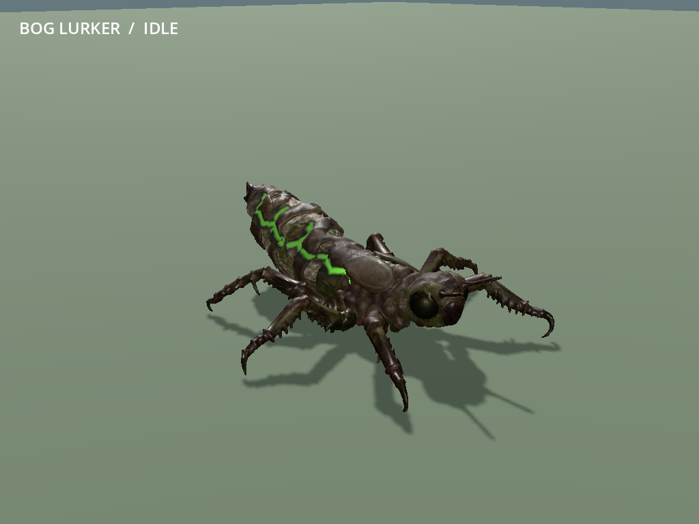
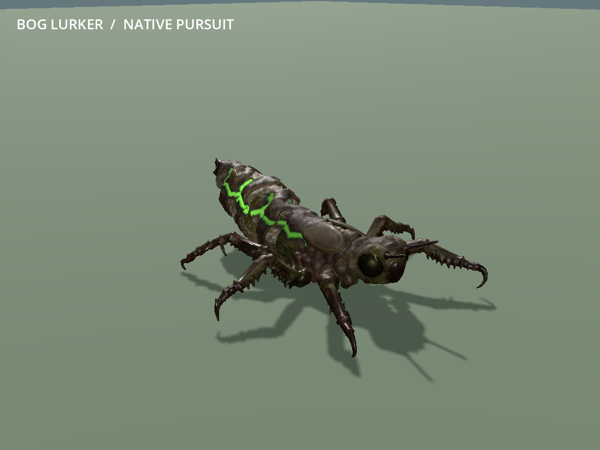
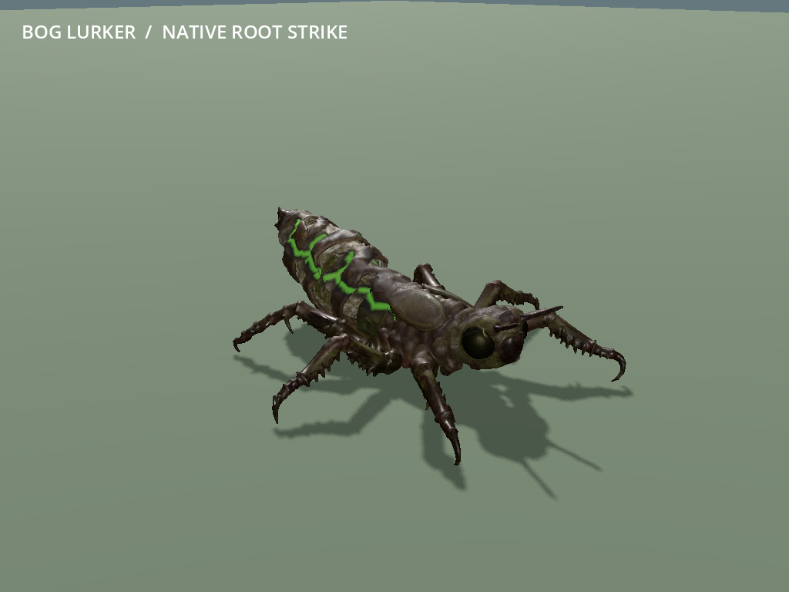
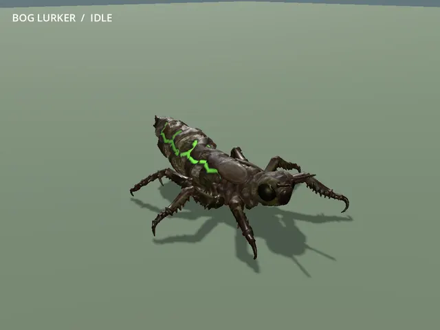

# MOB-05 — playable dragonfly nymph Bog Lurker

The approved six-legged v04 nymph replaces the Bog Lurker in ordinary new worlds
and Continue on main, published as `0d552ba`. Its 27-bone rig carries a grounded tripod
walk, quiet idle, head/labium anticipation and a short release/recovery driven by
the real native melee event. The legless layered abdomen, bog-iron crust and
deep connected lifelines remain. Native pursuit and root gameplay are preserved.

**Limits:** foot sliding, no terrain IK and simple generated joint/cavity detail
remain prototype limits. The low, wide animal differs from the unchanged upright
.35 m radius / 1.3 m collider; the native radial contact envelope extends beyond
the visible compact mouthpart. No squash, new reach, tongue tether, grab, wings,
extra hurtboxes or bleed change was added. Full performance impact and owner
playtesting remain deferred. Physical era additions, boss art and
significant underground lag remain open; legitimate caves/digging are unchanged.
R9 stays stopped.

The owner praised the nymph in the worker task and confirmed with the coordinator
that the same task should continue the tortoise. Visual approval is recorded;
this is not a claim of broader hands-on gameplay or performance testing.

## Mainline adoption and completed tortoise continuation

The checked worker commit `89bde373edae90005ee26888a140b34816eb82fb` was adopted
without conflicts as `0d552ba`. Game and nymph-tool files match the checked
worker exactly. Its **11 source, 42 native and 14 Continue checks** were reused;
one headless main import passed in **7.94 seconds**, exit 0, no reported errors.
The compact [main import result](../../game/tests/mob05/evidence/mainline-import.json)
is retained; logs/private state are in
`D:/Wroughtwild/work/mob05-nymph/build/mob05/mainline-adoption/`.

The ordinary `577ac96..0d552ba` push to origin/main succeeded. No rendered review,
new source inspection, combat matrix or performance gate was run. The owned
import exited, no override remains, and owner captures were preserved.

MOB-06 continued in the same owner-started task, in the separate
`D:/Wroughtwild/work/mob06-tortoise` checkout on `codex/mob06-tortoise`, based on
the original nymph worker commit `89bde37`. The coordinator subsequently adopted
only the new tortoise commit as `5c1b360` and pushed it. Both tasks' slices are
complete; [the tortoise result](mob06-tortoise-result-2026-09-15.md) records the
final regular-roster adoption. No duplicate worker or repeated nymph merge is needed.

## Owner visual approval

After the worker handoff, the owner said "Love it - next", approving the shown
nymph and continuing to MOB-06 tortoise. Hands-on gameplay/performance testing
remains deferred. The checked nymph commit is 89bde373edae90005ee26888a140b34816eb82fb.

## Focused verification

Concrete risks: unsupported/deformed legs or abdomen, double family scaling,
wrong melee/root timing, shared poses/materials, and stale strikes or changed
ownership on Continue. Three focused groups were completed, using Forward+ for
the only rendered native view:

| Group | Actual result |
| --- | --- |
| Selected rig/export and saved master | **11 checks passed**: six fitted thoracic chains, supported abdomen/head/labium/antennae, four baked clips, normalized weights, original packed maps and representative pose clearance. Maximum foot-target error 0.0000001932 source units. |
| Import and native actor/capture | Import exit 0 in **37.35 s**. **42 native assertions passed**, including the nine-second capture, in **10.53 s**. No reported script/shader errors. |
| Ordinary generated pack/death/Continue | Seed 77 `frontier_v6` fen pack; **14 assertions passed** in **37.84 s**. A native pack-member death advances the loot counter once. Its one loose pickup, native progression and finite-source ownership remain exact after ordinary SaveManager write/read. |

Native assertions retain 120 life, 6 physical damage, bleed immunity, 1.8 m/s
movement, 2.4 m attack range and .9-second windup. A confirmed native release
pays the exact seeded mitigated hit and applies the existing 1.2-second root.
Root holds attempted walking; the learned dash moves the real player and breaks
it. Native expiry remains exact. Cosmetic sampling neither reapplies nor extends
root. Missed/out-of-reach and solid-cover releases apply neither damage nor root.
Pursuit, stagger cancellation, exact frozen bones, thaw, pause, independent
instances sharing the mesh, rebind and death pass. No animation calls damage.

Continue retains seed/profile, native sim/leyline state, exact loose ownership
and the death loot sequence, with one nymph rig/observer and no replayed cosmetic
strike. The first comparison failed because its default JSON serialization
rounded nonempty floating-point drop fields. A small diagnostic isolated that
rounding; the fixture now matches SaveManager's full-precision serialization,
retaining exact equality of all fields. No gameplay/save code was changed.
The failed logs and diagnostic remain in `build/mob05/restore-attempt01/` and
`build/mob05/drop-diagnostic.json`.

The first source gait build caught an unreachable rear-leg target. A fitted
rear knee adjustment resolved it before the selected export. Automatic collapse
produced five duplicate triangles; validation removed them, and the final saved
master topology is clean. The dense original was not modified. Source logs are
retained in this worktree's `build/mob05/`.

Original ART-06C source identity, scar-depth and texture evidence was reused.
Unchanged fauna/other-mob evidence was reused; the dispatch only adds the nymph
key. There was no native rebuild, benchmark, renderer/seed matrix, parent
reconstruction or broad campaign review. This creature fixture does not measure
underground performance or close that reported issue.

All owned check processes exited; the render mutex was released and the owned
`game/override.cfg` was removed. Private saves/logs/imports remain on D:.
Selected documentation media is excluded from Godot imports. A final local cache
restoration import passed in 28.49 s after generated-file cleanup, leaving the
worker checkout ready to launch. Godot reported that it recreated missing
untracked script UIDs from cache; no script/shader error occurred. These local
import/extraction files remain untracked and are excluded from the commit.

Compact [source checks](../../game/tests/mob05/evidence/source-checks.json),
[native checks](../../game/tests/mob05/evidence/native-checks.json),
[Continue checks](../../game/tests/mob05/evidence/restore-checks.json),
[rig report](../../game/tests/mob05/evidence/rig-report.json) and
[precision diagnostic](../../game/tests/mob05/evidence/drop-precision-diagnostic.json)
are retained for coordinator reuse.

## Runtime, provenance and visual tuning

- [Runtime descriptor](../../game/assets/authored/roster/bog_lurker/asset.json):
  **79,995 triangles**, 37,214 Blender vertices, one skin surface, 27 bones,
  at most three normalized weights, and original base/ORM/scar maps.
- Dense editable master:
  `D:/Wroughtwild/source-art/mob05-nymph/rig-v02/bog_lurker-rigged.blend`.
  It retains the **290,654-triangle** v04 host, selected rig/runtime mesh,
  packed maps and clips. Automatic simplification is not manual retopology.
- Immutable input and matched setup receipt:
  `D:/Wroughtwild/source-art/mob05-nymph/input-art06c/`. The canonical ART-06C
  original and this selected five-file input remain intact. Rejected eight-leg
  v02 anatomy was never used.
- [Recipe and reproduction](../../tools/wroughtwild-mob05-nymph/README.md) and
  [visual controls with purposes](../../tools/wroughtwild-mob05-nymph/rig.json).

The nymph's -Y source forward exports to Godot +Z; **180-degree yaw** aligns it
with native -Z. **Uniform .82 metres/source unit**, zero extra ground offset and
the parent's existing **1.4 family size** produce an approximately 2.30 m-long
full rest envelope. Optional elite size is inherited once. Lurker receives no
.76 humanoid reduction. No Enemy, PlayerCombat, native tuning or save code changed.

The three-segment legs are fitted to this source's low thorax, independently of
the beetle. Three longitudinal supports keep the abdominal layers legless and
connected. The .016-unit body lift, .10 sweep, .05 lift and 65 percent stance
provide local floor contact. .9-metre cosmetic stride deliberately accepts
sliding. Head/labium angles and .045-unit short extension are presentation only.
Authored recovery spans .225 seconds at 40Hz and is resampled into the existing
.22-second cosmetic window. Full controls, durations, material values and their
purposes are documented in the recipe/descriptor. No gameplay tuning is added.

## Normal-game playtest later

From the normal owner checkout:

```powershell
& 'C:/Users/Matty/Godot/Godot_v4.5-stable_win64.exe' --path 'C:/Users/Matty/Dev/project-wroughtwild/game'
```

1. Choose Continue or a new world; no art/showcase/test flag is required.
2. For a reproducible new world, choose seed **77**. The checked native fen pack
   is near **X 902.5, Y 32, Z 202.5**. Approach through normal world traversal.
   Other seeds retain their own generated packs.
3. Approach/retreat to see the heavy gait. Let the existing head/labium warning
   release: a hit roots you, and ordinary dash breaks it. Leaving reach or solid
   cover prevents the hit/root. Use existing freeze/stagger and pause controls.
4. Save and Continue; one nymph rig remains, and its old cosmetic strike clears.

## Selected media

Actual native-actor frames in a flat capture fixture with scripted camera/target,
not screenshots of the ordinary generated fen. The nine-second motion shows
idle, pursuit, naturally timed root strikes and freeze.






## Commit and publication

The worker committed the complete slice as `89bde37` on **`codex/mob05-nymph`**
without pushing. The coordinator adopted and pushed it as `0d552ba`, as recorded
above, then updated the result and aggregate status. Tortoise completion was
published separately as `5c1b360`; the nymph commit was not reapplied.
