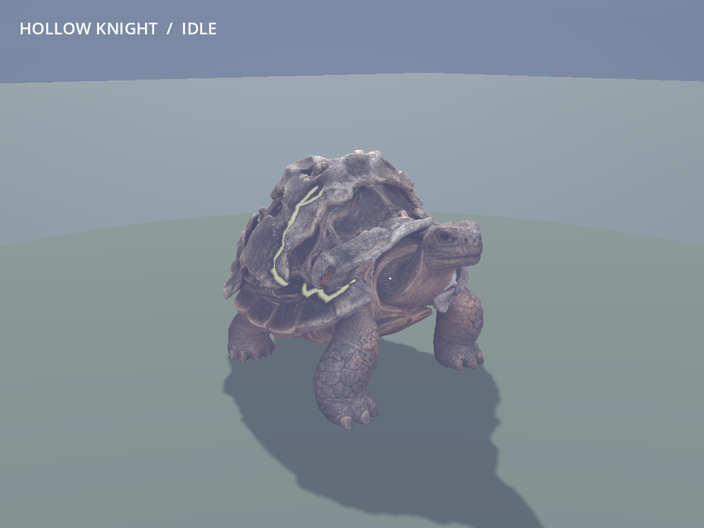
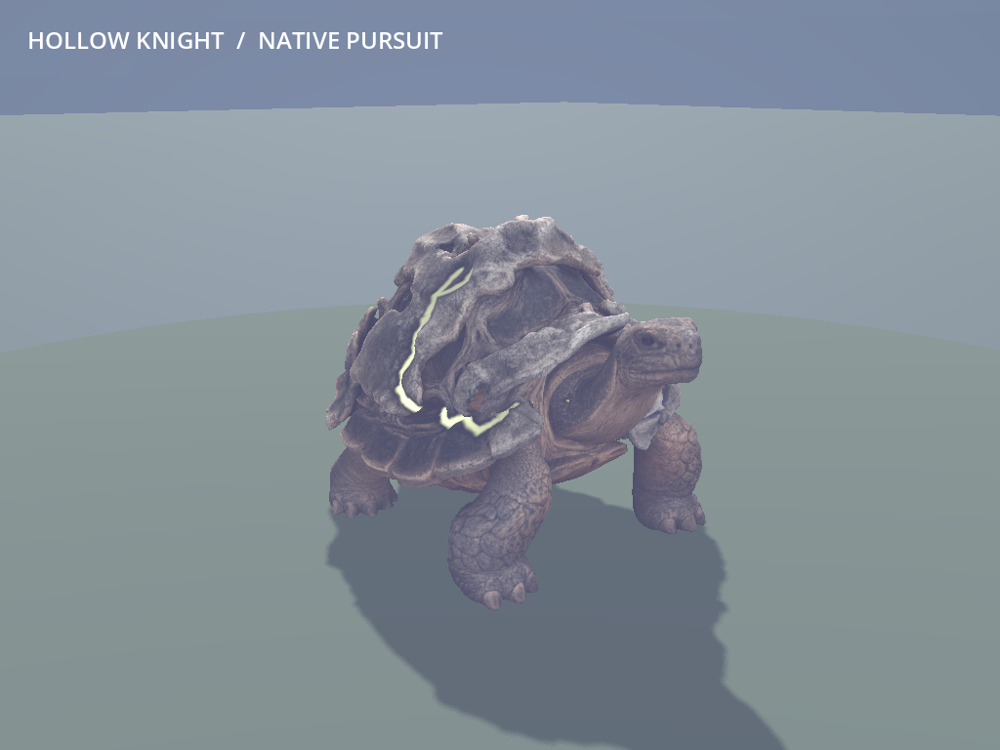
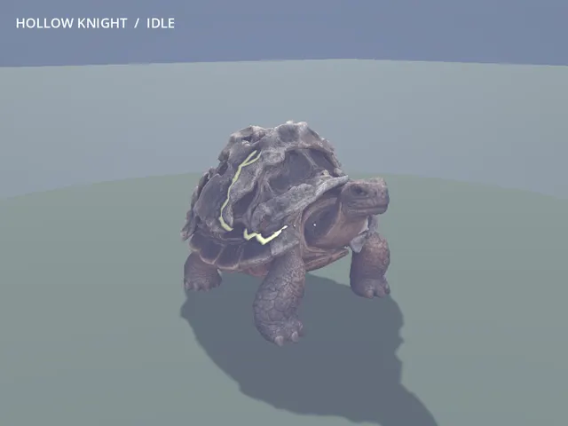

# MOB-06 — playable tortoise Hollow Knight

The approved living tortoise now replaces Hollow Knight in ordinary new worlds
and Continue on main, published as `5c1b360`. Its fitted 17-bone rig gives it a heavy
four-leg walk, quiet breathing, supported neck/head anticipation and a short
melee release. The hollow mineral mantle, intact scutes and pale connected
lifelines remain. Native ward, pursuit, defenses and melee rules are preserved.

**Limits:** foot sliding and no runtime terrain IK remain prototype limits.
The broad shell differs from the unchanged upright .35 m radius / 1.3 m collider;
the native melee envelope extends beyond the visible short head strike. Source
joint/cavity detail remains approximate, with one runtime detail level. Full
performance impact and hands-on owner playtesting remain deferred. Physical era
variants, boss art and significant underground lag remain separate work. R9 stays
stopped; legitimate caves/digging are unchanged.

The owner's "Love it - next" approved the shown nymph and continued the agreed
sequence to this tortoise. Standing prototype approval covers this implementation;
it does not claim the owner has personally played or reviewed this new result.

## Mainline adoption — regular replacement roster complete

The coordinator adopted `39fd76abd10bd72e46f187c9b306c4655958f03b` as `5c1b360`.
The nymph dependency was already on main as `0d552ba`; it was not reapplied.
The worker's nymph-approval note merged without losing the newer coordinator
publication record. Runtime art/assets/scripts, native tuning, tortoise tools
and fixtures match the checked worker commit exactly.

The worker's **12 source checks, 50 native assertions covered by passed evidence,
corrected capture and 14 Continue checks** were reused with the original failure
history below intact. One headless main import passed in **5.05 seconds**, with
exit 0 and no reported errors. The compact
[main import result](../../game/tests/mob06/evidence/mainline-import.json) is
retained; detailed logs/private data are in
`D:/Wroughtwild/work/mob06-tortoise/build/mob06/mainline-adoption/`.

The ordinary `2044d5d..5c1b360` push to origin/main succeeded. No new renderer,
combat replay, parent reconstruction or performance gate was run. The owned
import process exited and no override remains. Owner captures were preserved.

**All six approved regular replacements are now integrated on main:** porcupine
Cinder Archer, ram Stone Husk, crane Shrieker, beetle Gloom Crawler, nymph Bog
Lurker and tortoise Hollow Knight. This completes their base rigs, animation and
native adoption; full performance coverage, later-era physical forms, boss art
and owner station/campaign feedback remain distinct. Significant underground lag
is still unresolved. R9 remains stopped; no further review wave was launched.

## Focused verification

Concrete risks were unsupported legs/neck or shell deformation, double visual
scale, changed ward/melee behavior, shared poses, and stale attacks or changed
ownership on Continue. Three focused groups were completed:

| Group | Actual evidence |
| --- | --- |
| Selected rig/export and saved master | **12 checks passed**: dense v02 retained, 17 bones/four leg chains, supported neck/head/tail, rigid upper shell, four baked clips, packed original maps, normalized weights, clean final topology, foot targets and representative pose clearance. Maximum foot-target error **0.0000001863 source units**. |
| Import and native use/capture | Headless import completed in **36.14 s**, with no script/shader errors; its original launcher exit-code field was unavailable. Native use and the corrected capture establish successful loading. **50 distinct native assertions are covered by passed evidence**: initial run had 49/50 passing in **11.08 s**, with only the capture no-focus check failing; corrected capture-only run passed **3/3** in **11.49 s**, exit 0. The gameplay checks were reused. |
| Generated pack/death/Continue | Seed **77**, `frontier_v6`, **ember_wastes** pack at **(898.5, 42, 374.5)**; **14 assertions passed** in **38.66 s**, exit 0. Ordinary SaveManager write/read retains progression, finite-source ownership, world identity, loot sequence and transient-pose reset. |

Native checks preserve 170 life, 8 physical damage, 2.6 m/s movement, 2.0 m
range and .7-second windup. Actual player damage against a nearby ally is reduced
by the existing **30 percent ward**. The **5 m** boundary, no self-ward and trial
separation hold. Stagger hides the native aura and removes the reduction;
recovery restores it. Freeze preserves the existing ward behavior and holds the
exact pose. The native aura is kept visible in the selected pictures and clip.
Ignite immunity and quarter fire damage remain; the shell adds no physical
resistance. A native release pays its exact seeded mitigated melee hit; missed
reach and solid cover block it. Cosmetic sampling cannot add another hit/root.
Pursuit, family/elite scale, independent rig/material instances sharing the mesh,
pause, stagger, thaw, rebind and death pass.

A generated native pack-member death advances the loot counter exactly once.
Its selected loot outcome has **zero loose pickups**; that complete snapshot,
progression and finite-source state remain exact after Continue. This fixture
does not claim a nonempty loot outcome. The unchanged save/drop implementation
also retains the nymph dependency's existing nonempty-drop evidence. Continue
selects one tortoise rig/observer and clears the old cosmetic strike.

The first capture exposed a launcher issue: Windows PowerShell's UTF-8 BOM made
Godot ignore the no-focus/viewport override. That process exited. The launcher
now writes BOM-free UTF-8 and captures the process handle before waiting, so an
unavailable exit code cannot silently pass. Only capture was repeated, on the
same Forward+ renderer; its visible pointer, unfocusable window and 1024×768
viewport are recorded. No gameplay/asset inputs changed between these checks.
The final script also saves the already selected walk frame directly. The
initial failed assertion/logs remain in `build/mob06/capture-attempt01/` and the
compact evidence; the corrected capture is in `build/mob06/capture-fixed/`.

Automatic collapse produced two duplicate triangles; validation removed them.
Final saved topology is clean, with the dense original untouched. Original
ART-06C identity/depth/texture evidence and unchanged other-mob checks were
reused. There was no native rebuild, benchmark, renderer/seed matrix, source
matrix, parent reconstruction or broad campaign review. All owned processes
exited; the render mutex and owned `game/override.cfg` were released/removed.
Local imports and private saves remain on D: and are excluded from the commit.

Compact [source checks](../../game/tests/mob06/evidence/source-checks.json),
[native coverage](../../game/tests/mob06/evidence/native-checks.json),
[initial native result](../../game/tests/mob06/evidence/native-attempt01.json),
[corrected capture checks](../../game/tests/mob06/evidence/capture-checks.json),
[capture comfort](../../game/tests/mob06/evidence/capture-comfort.json),
[Continue checks](../../game/tests/mob06/evidence/restore-checks.json) and
[actual run outcomes](../../game/tests/mob06/evidence/run-results.json) support
coordinator reuse without repeating the review.

## Source, runtime and visual controls

- [Runtime descriptor](../../game/assets/authored/roster/hollow_knight/asset.json):
  **79,997 triangles**, 38,788 Blender vertices, one surface, 17 bones and at most
  three normalized weights. Original base, ORM and scar maps are retained.
- New editable master:
  `D:/Wroughtwild/source-art/mob06-tortoise/rig-v01/hollow_knight-rigged.blend`.
  It retains the **295,369-triangle** v02 host, fitted runtime mesh/rig, packed maps
  and four clips. The simplification is automatic, without manual retopology or
  a new normal bake.
- Immutable selected input and matched five-file selection receipt:
  `D:/Wroughtwild/source-art/mob06-tortoise/input-art06c/`.
  Only those five source files were copied; canonical ART-06C originals remain.
- [Recipe/reproduction](../../tools/wroughtwild-mob06-tortoise/README.md),
  [visual controls with purposes](../../tools/wroughtwild-mob06-tortoise/rig.json)
  and [selected rig report](../../game/tests/mob06/evidence/rig-report.json).

Source -Y forward exports to Godot +Z; **180-degree yaw** aligns native -Z.
Uniform **.9 metres/source unit** is applied before the native **1.25 family
size**, giving a rest envelope about **2.25 m long, 1.55 m wide and 1.50 m tall**.
The adapter cancels only the existing .76 humanoid shrink. Optional native elite
size applies once. No aspect-ratio squash, collider or hitbox adjustment occurs.

The four measured leg chains use .16-unit foot sweep, .055-unit swing lift and
**78 percent stance**, keeping at least three feet planted on the local plane.
The -.008-unit settled body offset and .003-unit breathing preserve clearance.
A 1.5 m cosmetic stride gives roughly 1.39 cycles/s at native family speed,
accepting sliding. Neck/head windup angles are -.08/.03 radians; short release
uses .16/-.07 radians. They are visual only. The 40Hz baked .225-second recovery
is sampled inside the existing .22-second cosmetic window. Palette, pulse and
map semantics match the approved source. All introduced controls have plain
purposes in the recipe/descriptor; no gameplay tuning was added.

## Ordinary play later

```powershell
& 'C:/Users/Matty/Godot/Godot_v4.5-stable_win64.exe' --path 'C:/Users/Matty/Dev/project-wroughtwild/game'
```

Choose Continue or a new world without test/showcase flags. Seed 77's checked
ember-wastes pack is near **X 898.5, Y 42, Z 374.5**; approach through ordinary
traversal. Watch the heavy walk and neck warning, fight a nearby ally within the
ward, stagger the knight and compare normal damage, then save/Continue. The
owner's usual saves were not touched by these private fixtures.

## Commit and coordinator handoff

The worker committed `39fd76abd10bd72e46f187c9b306c4655958f03b` on
**codex/mob06-tortoise**, based on the checked nymph `89bde37`, without pushing.
The coordinator adopted only the new tortoise commit and pushed it as `5c1b360`,
then updated the result/aggregate status. Existing owner captures were preserved.

## Selected native media







[Windup picture](../../game/tests/mob06/evidence/tortoise-windup.png) and
[media metadata](../../game/tests/mob06/evidence/media.json). The nine-second clip
encodes all 270 captured frames at 640×480; WebP coalesces identical held frames
into 248 encoded frames while preserving exactly 9,000 ms.
