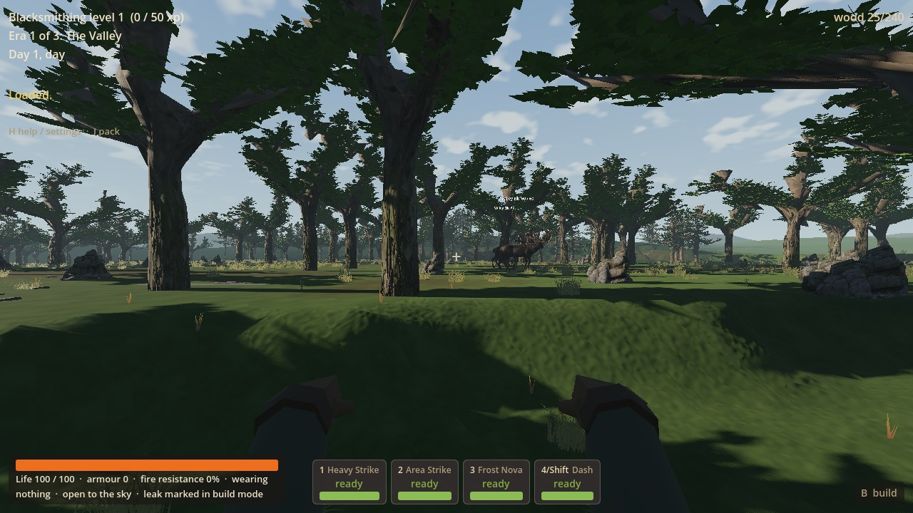
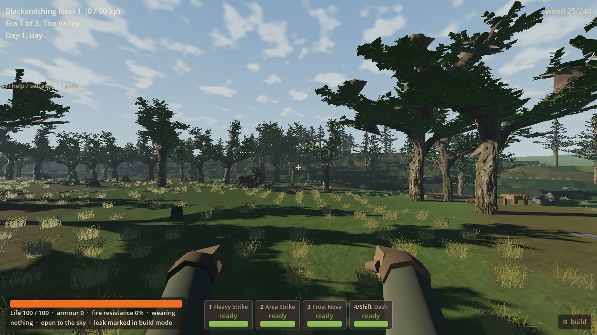
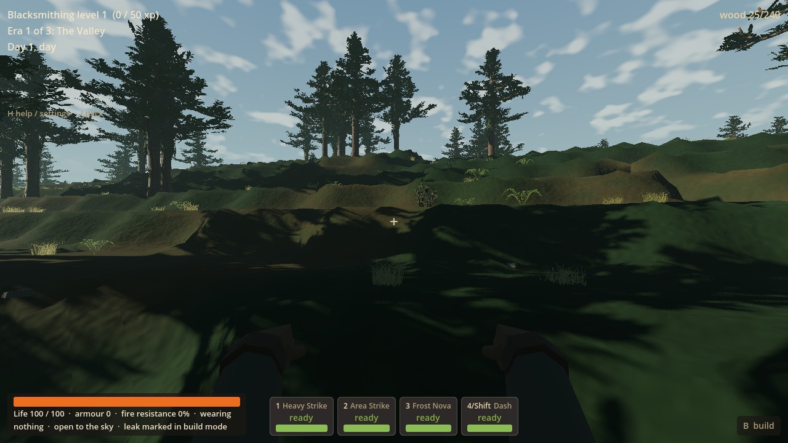
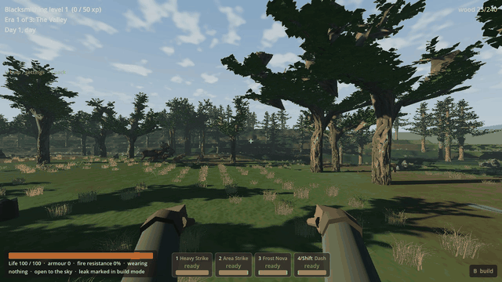

# RF-01 — meadow and woodland recovery result

RF-01 adds seeded patches of fuller low grass and fern accents to the ordinary
V6/Living Frontier meadow and woodland floor. It reuses the adopted B2/R7 plants
and material motion while keeping native terrain, collision, trees, sites,
paid ownership and save rules authoritative. A real 76.42 m walk and focused
placement/Continue checks cover this first playable vegetation slice.

## Remaining limits

- Low growth remains visibly patchy, especially at steep native shelves, home
  clearings and reserved work areas. It is not yet the continuous recovered floor
  suggested by the references. Terrain undulation remains later RF-02 work.
- The one nearby seed-77 segment reaches meadow/woodland and oldgrowth trees but
  **does not include an impact margin**. Native impacts are distant; no terrain,
  trees or sites were moved to produce a composition, and no seed search followed.
- One Forward+ daylight route was rendered. Hardware impact, other conditions,
  full LF campaign behavior and broad regression coverage are unmeasured.
  Owner playtesting is deferred, not a claim of personal visual acceptance.
- PLAY-03 underground lag remains unresolved and parked. R9 was not resumed.

## Ordinary game behavior

`Terrain` creates a transient RF cover helper for the actual geography identities
`frontier_v6`, `living_frontier_wave1` and `living_frontier_wave3`. Later LF policies
use those identities. `GroundCover` replaces only their eligible grass/fern
presentation on meadow/forest grass or forest-floor surfaces. Flowers, scree,
other biomes and V1–V5 keep their existing paths. There is no new launch switch,
world profile, saved cover field or migration.

A dedicated seed/profile/cell hash and visual salt choose roots, species, size and
yaw. Fourteen-metre noise patches vary the chance of growth. Grass uses three
crossed, progressively smaller copies of the shipped LOD2 crown; ferns use one.
The originals, R7 materials, wind clock and older R7 size assertions are unchanged.
Existing cover distance/fade and chunk publication, retirement and local rebuild
paths remain in use; no permanent scan or new scheduler was added.

Each full moving footprint stays inside its owning native cell. Nine bounded,
cached triangle samples define the rooted plane and reject abrupt ledges, broken
support and deep floor projection. Only the plant follows that plane; terrain and
player support do not move. The established native resource, home, ruin, impact,
lab, source-route and approach reservations keep work areas open.

Retained transforms and sway-inclusive bounds let the existing local building
refresh hide and restore overlapping cover. RF station suppression also uses the
station's actual saved collision pose and existing building clearance. The normal
paid kit placement triggers this refresh. Continue applies the same path to
restored ownership before the chunk becomes visible. No costs, yields, placement
rules, refunds, progression or campaign events were changed.

## Tuning and purpose

The controls live in [low_cover.tres](../../game/rf01/low_cover.tres), with a
plain-language `design_purpose` for every exported setting.

| Control | Current value | Player-facing purpose |
| --- | --- | --- |
| Visual salt | 91073 | Repeatable cosmetic variation independent of gameplay RNG. |
| Patch scale | 14 m | Join nearby growth into swathes with quieter openings. |
| Sparse / dense chance | 0.28 / 0.94 | Growth chance before terrain, site and ownership rejection; not measured world coverage. |
| Grass width / height | 0.94 / 0.38 m | Fuller low silhouettes with readable ground and sightlines; edge grass is two-thirds height. |
| Fern width / height | 0.96 / 0.43 m | Low woodland accents inside the checked ground footprint. |
| Meadow / forest fern share | 0.025 / 0.22 | Occasional open-ground ferns, more woodland fern accents. |
| Edge-grass share | 0.28 | Mix shorter asymmetric silhouettes among meadow grass. |
| Minimum scale | 0.76 | Natural size variation beneath the maximum dimensions. |
| Grass layers / turn / size step | 3 / 2.4 radians / 0.08 | Fill each supported crown without adding wider roots or leaf reach. |
| Support rise / plane error | 0.46 / 0.075 m | Reject a group that would bridge broken or sharply changing ground. |
| Root embed | 0.025 m | Join the root plane to the sampled surface. |

## Exact normal-game playtest route

Use the normal main scene, not a test scene. From PowerShell:

```powershell
& 'C:/Users/Matty/Godot/Godot_v4.5-stable_win64_console.exe' --path 'D:/Wroughtwild/work/rf01-reclaimed-ground/game' -- --world-seed=77
```

**New World:** enter `77` in **New world seed**, then choose a class (the fixture
used Warden). `H` confirms seed `77` and `frontier_v6`. From spawn X/Z
`(512.5, 512.5)`, travel about 72 m west and 67 m north to `(440.5, 445.5)`, just
southwest of the first home clearing. West is decreasing X; north is decreasing Z.
Walk west through `(411.5, 445.5)`, `(391.5, 440.5)` and `(363.5, 439.5)` toward
the existing oldgrowth woodland around `(375, 449)`. The controller completed
76.42 m of this segment, stepping/jumping over native terrain. The start pose was
set by the capture fixture; every subsequent step used active player physics.

**Continue:** choose **Continue saved world / suspended trial**. Any saved eligible
V6/LF world receives the cosmetic update through normal loading and streaming;
its recorded seed, profile, edits, finite resources and paid structures remain
in charge. Use that world's usual LF launch option, for example:

```powershell
& 'C:/Users/Matty/Godot/Godot_v4.5-stable_win64_console.exe' --path 'D:/Wroughtwild/work/rf01-reclaimed-ground/game' -- --living-frontier-wave7
```

The above fixed route belongs to V6 seed 77; it is not a promise that a different
LF geography has the same local route. Owner saves were never opened or copied.
All fixtures used `build/rf01/private-world.json` and private D: user directories.

## Verification actually run

The three focused groups addressed concrete risks: unsupported/non-deterministic
plants after edits, interference with paid use/Continue, and inability to walk or
render the changed ordinary world. There was no renderer/seed matrix, benchmark,
native rebuild, source-package review or broad campaign run.

| Group | Evidence and outcome |
| --- | --- |
| Setup and placement/lifecycle | Headless import passed with zero engine errors. One seed/native-map read selected the route. The first 48-assertion fixture passed geometry, slope/collision root agreement, same/reverse rebuild, boundary excavation, ledge/cave rejection, and restored-height checks. Six later assertions failed because test resource acquisition under-paced finite pickups. |
| Affected paid use | Corrected only the fixture's resource-record capture and pickup pacing, then reran the affected use portion: **38 checks, 0 failures**. Ordinary finite gathering funded nine paid octagonal floor pieces and a crafted workbench. Actual costs, local/full footprint mask agreement, usable station, save, removal and cover restoration passed. Unchanged geometry evidence was reused. |
| Fresh-process Continue | An initial fixture error read an absent optional empty `broken_blocks` key; its owned process was stopped and the fixture fixed. The completed Continue run passed **16 of 17** checks: exact native possessions/progression, blocks, finite resources, drops, other saved arrays, native heights, exact cover/masks, real support/movement and resave. Its one failure was test JSON float truncation in station yaw. The fixture now uses SaveManager's full-precision serialization; the exact station ownership/pose assertion passed in both the planned and final Forward+ walks. No standalone Continue rerun was claimed. |
| Forward+ walking and final mesh check | One route/daylight condition, active world/native physics and real controller; first capture passed. Visual inspection prompted one bounded crown-fullness adjustment inside the same radii, then the same route was captured again. Final run: **exit 0, zero engine errors, zero assertions failed**, all crown vertices inside the checked radius/root/sway bounds; **76.42 m**, 917 controller frames and 120 viewport captures. Actual capture time was 85.39 s, not a performance measurement. |

All required assertions are covered by those retained passes and the affected
retests; earlier fixture failures are not relabelled as passing runs. The final
mesh-only change keeps the checked roots, support radii and placement policy;
unchanged lifecycle/use evidence was reused. LF selection and representative
excluded profile/biome cases were checked at helper level, not a campaign matrix.

[Verification receipt](rf01-evidence-2026-09-15/verification.json) and compact
logs/check reports beside it preserve these outcomes. The full local fixture
outputs remain under `build/rf01`. The runner held `Local\WroughtwildArtRender`,
verified visible/free mouse and no-focus throughout, and removed its BOM-free
owned override. All owned checks have ended; no test is left running. Delivery link/JSON,
media-recipe and PowerShell syntax checks plus diff whitespace checks passed.

## Selected pictures and walking clip

Actual final game viewport captures; no image synthesis or retouching. The GIF
selects/resizes the captured frames to 640×360 at 10 fps for eight seconds at
normal playback speed. Full 1280×720 source frames remain in `build/rf01/media`.









## Worker publication

Prepared from `0a8c0477ceeb0669bfe8c871f6498824324f51cf` on
`codex/rf01-reclaimed-ground`. Runtime code, focused fixture/runner recipes,
selected evidence and this result are the worker commit's scope. The final chat
reports its checked SHA. No main integration or push was performed: the
coordinator owns both, along with aggregate queue updates. No RF-02 or review
worker was started.