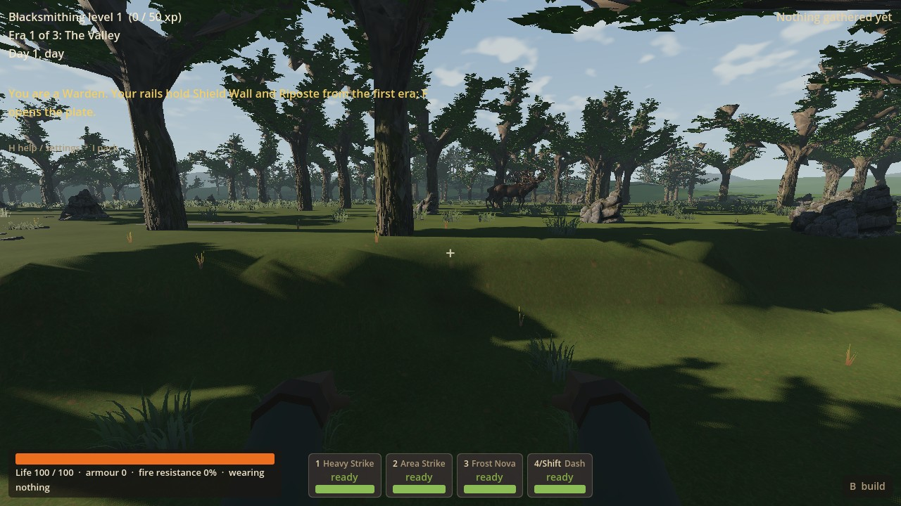
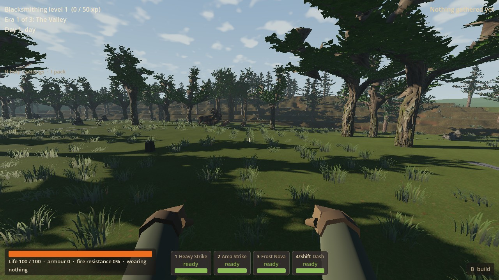
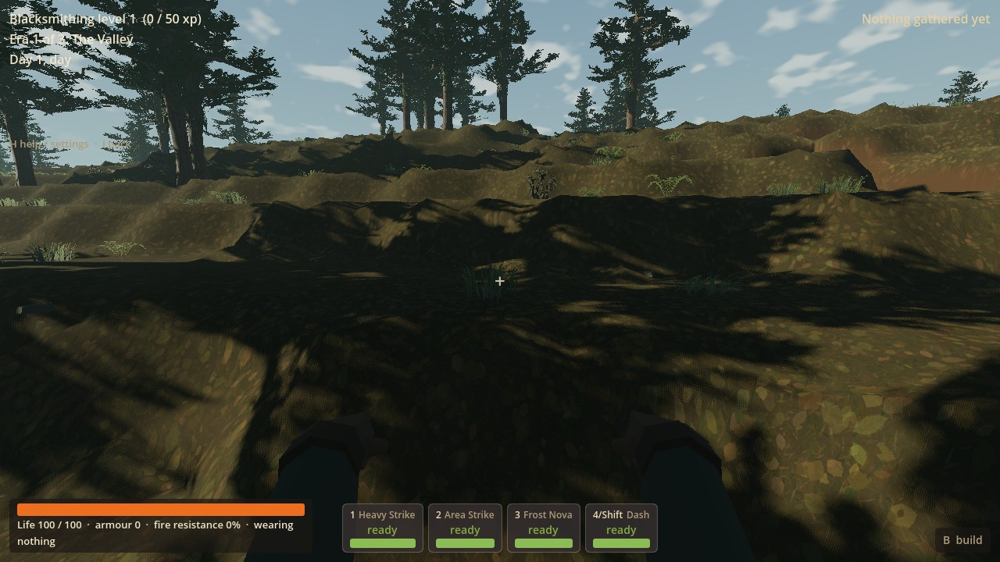
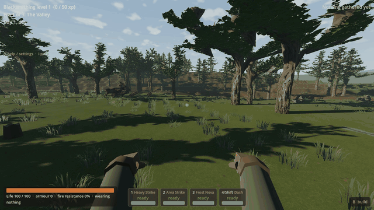

# RF-02 — ground materials and grass result

RF-02 gives ordinary V6/Living Frontier meadow and woodland finer turf, soil and
leaf-litter surfaces, with fuller curved grass that roots into that ground.
The coarse embossed ground grain is replaced on these surfaces. Two original
Blender clumps now occupy RF-01's existing placements in New World and Continue.
This playable art iteration is integrated on main as `7c1e3a7`.

## Mainline adoption

On 15 September 2026 the coordinator adopted worker `9180001` onto main as
`7c1e3a7` under standing prototype permission. Its 29 asset checks, 23 final
Continue/use checks and successful ordinary Forward+ walk were reused; the
initial fixture failures below remain recorded. One additional hidden headless
main import passed in **5.06 seconds, exit 0, zero reported errors**. Private
logs and temporary state are at
`D:/Wroughtwild/work/rf02-ground-grass/build/rf02/main-integration`.
No new rendered review or gameplay matrix was run, and no owned test remains
running. The coordinator's final chat records the actual push outcome.

The two selected actual captures were inspected and the retained editable master
was confirmed present. This does not claim personal owner visual acceptance or
measured hardware cost. The original worker delivery and evidence follow.

## Remaining limits

- Existing shelves, clearings and reserved work areas still leave patchy cover.
  Grass can still read as separate clumps; this slice preserves RF-01's
  distribution and does not provide new terrain undulation or continuous grass.
- The seed-77 route reaches woodland/oldgrowth but no impact margin.
  No trees, sites, native heights or collision were moved for the pictures.
- One Forward+ daylight route was captured. Fine shimmer in other conditions,
  distant repetition, broader game balance and hardware cost remain unmeasured.
  The new grass has more triangles per clump; this is not a performance clearance.
- Owner playtesting remains deferred. Standing approval covers ordinary art
  choices/integration; it does not claim the owner has played or liked this result.
  PLAY-03 underground lag remains unresolved and parked. R9 stays stopped.

## Actual changes

- Original 1024-square turf/thatch/soil and woodland leaf/needle/humus albedo maps,
  each with packed relief/roughness. A 2.4 m scale, mipmaps, anisotropic filtering,
  rotated sampling and restrained apparent relief replace oversized grain without
  displacing ground.
- A transient mask from the saved world's native biomes enables this treatment
  only on meadow/forest grass, forest-floor and dirt in `frontier_v6`,
  `living_frontier_wave1` and `living_frontier_wave3`. Later LF policies reuse
  those identities. The shader defaults off elsewhere; native vertex material
  joins, stone weight and augmentation tint remain.
- Original Blender meadow and lower asymmetric edge forms: 78 / 46 folded,
  tapered blades; 1,404 / 828 triangles; one opaque surface each. Dark basal
  growth, curved silhouettes and restrained lighting connect them to the turf.
  They replace RF grass's three stacked far-detail crowns only.
- RF01 fits every blade within its existing 0.47 m radius and 0.38 / 0.2508 m
  heights. Its 0.4782044 m support radius contains maximum inherited wind.
  The 5.5 s pause-aware R7 wind, support sampling, seed/cell placement,
  reservations, chunk/edit lifecycle, batching and distances remain.
- Native terrain, collision, anchors, finite stock, progression, saved ownership
  and paid construction rules are unchanged. Ferns, shrubs, canopy, flowers,
  V1–V5 and other biomes retain their paths. No migration or showcase switch.

New artistic controls have plain-language purposes in
[ground.tres](../../game/rf02/ground.tres),
[grass.tres](../../game/rf02/grass.tres) and
[grass.json](../../tools/wroughtwild-rf02/grass.json).
Existing global look resources are not modified.

## Focused checks actually run

The three groups address missing/bad bindings, walking appearance, and new mesh
envelopes at saved paid work. No source-package rebuild, native rebuild,
renderer/seed matrix, benchmark or campaign/economy replay was run.

| Group | Result |
| --- | --- |
| Import and assets | Headless import: exit 0, 36.87 s, no reported errors. After correcting three explicit float declarations in the new check script, **29 checks / 0 failures**: profile/biome/surface selection, four mipmapped maps, rooted mesh bounds and analytic maximum wind. Initial parse failure ran no assertions; its owned process was stopped. |
| Ordinary New World walk | Normal seed/class handler, V6 seed 77, real player physics and active world. **76.42 m / 917 controller frames / 120 viewport frames**. Forward+, exit 0, no failed assertions or engine/shader errors; 58.01 s including startup/capture. One route/condition; no visual rerender. |
| Private Continue/use | RF01 paid test save only, copied to a private filename. Final Forward+ smoke: **23 checks / 0 failures**, exit 0, no reported errors, 54.93 s. Exact native/player/world ownership, nine paid octagonal floor pieces, workbench use, real movement, private resave, eight hidden overlapping plants, full-refresh agreement and one excavation edge all pass. |

Two initial headless Continue attempts each passed 21 of 22 assertions.
Their GPU-transform query returned identity matrices despite all eight matching
CPU visibility flags being hidden. The same assertion was retained and run
after a real Forward+ frame: all eight render transforms have zero scale.
This was a limitation of the headless rendering query, not a production
suppression change or a hidden clearance pass.

RF01's unchanged placement, determinism, support, economy and lifecycle
evidence is reused from its
[result](rf01-reclaimed-ground-result-2026-09-15.md).
V1–V5/LF selection was checked at helper level, not by replaying campaigns.
An edit-script encoding mistake was removed before final Continue: original
UTF-8 text outside the narrow RF02 edits is restored. No runtime art changed
after the walking captures.

The runner held `Local\WroughtwildArtRender` for rendered checks, wrote BOM-free
no-focus overrides, retained process handles and checked exit codes.
Mouse opt-out/no-focus assertions passed. Overrides were removed and all owned
checks ended. Owner saves and desktop input were untouched. The only copied
test save was RF01's 8.7 MB private fixture, not its build directory.

Final Python/PowerShell syntax, JSON, local-link, media duration and diff checks
passed. A 33.64 s headless cache-preparation pass restored importer metadata
needed for local play after cleanup: exit 0, no errors, with warnings that UID
files were recovered from the existing cache. Runtime art did not change.
Generated import outputs remain local and uncommitted; tuned source import
settings are included. No test or renderer is left running.

[Verification receipt](rf02-evidence-2026-09-15/verification.json) and small
reports sit beside the selected media. Full logs/frames remain in `build/rf02`.

## Exact normal-game playtest

**Integrated main:** launch the normal owner checkout:

~~~powershell
& 'C:/Users/Matty/Godot/Godot_v4.5-stable_win64_console.exe' --path 'C:/Users/Matty/Dev/project-wroughtwild/game' -- --world-seed=77
~~~

Choose **Continue** for the existing eligible V6 world, or **New World**, seed
**77**, then a class for the route below. Existing LF saves use their usual LF
launch option instead. The changed ground/grass is enabled automatically;
existing saved terrain and ownership remain authoritative.

**Optional isolated worker play:** the retained D: launcher opens that worker's
ordinary game interactively with separate RF02
manual-play saves/preferences and restores the shell environment on exit:

~~~powershell
& 'D:/Wroughtwild/work/rf02-ground-grass/tools/wroughtwild-rf02/play.ps1'
~~~

1. **New World:** leave seed **77** in the field and choose **Warden**.
   From spawn X/Z `(512.5,512.5)`, head about 72 m west and 67 m north to
   `(440.5,445.5)`, southwest of the first home clearing.
2. Walk west through `(411.5,445.5)`, `(391.5,440.5)` and `(363.5,439.5)`.
   Oldgrowth is around `(375,449)`. West decreases X; north decreases Z.
   Use normal WASD/mouse-look and Space over native shelves. Look slightly down
   at open turf, short edge plants and woodland litter between trees.
   The capture fixture placed only the starting pose; subsequent motion used
   the real controller.
3. **Continue:** press **F5**, exit, rerun the launcher and choose
   **Continue saved world / suspended trial**. Ground/grass loads automatically.
   Manual-play saves are separate from owner saves and automated check saves.

For an existing owner LF save, launch the integrated main game instead of the
isolated launcher and choose Continue. Retain its usual LF option, for example:

~~~powershell
& 'C:/Users/Matty/Godot/Godot_v4.5-stable_win64_console.exe' --path 'C:/Users/Matty/Dev/project-wroughtwild/game' -- --living-frontier-wave7
~~~

The fixed route belongs to V6 seed 77, not every LF map. Both launch paths use
normal game controls; the optional worker launcher has its own separate saves.

## Source and selected actual media

Editable master:
`D:/Wroughtwild/source-art/rf02-ground-grass/rf02-grass-master.blend`

Source maps, recipes and receipts are retained in that directory. The compact
[source record](../../game/rf02/SOURCE.md) gives details and lineage.
Original B2 sources and owner landscape references remain unchanged.

Actual game viewport stills. The GIF selects/resizes captured frames to 640×360,
10 fps, eight seconds at normal playback speed; no retouching or synthesized
imagery. Full 1280×720 frames remain in `build/rf02/media`.

## Worker publication

Base `97034740da9e515b17d3910f1105393f23310184`, branch
`codex/rf02-ground-grass`. Final chat supplies the checked worker SHA.
Only this completed slice, recipes and compact evidence are committed here.
The coordinator owns main integration, aggregate tracking and push.
RF02 stops here; no landforms, other biomes or additional workers were started.
