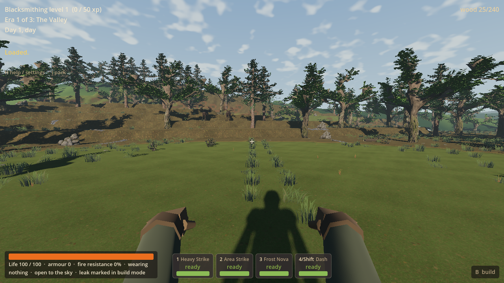
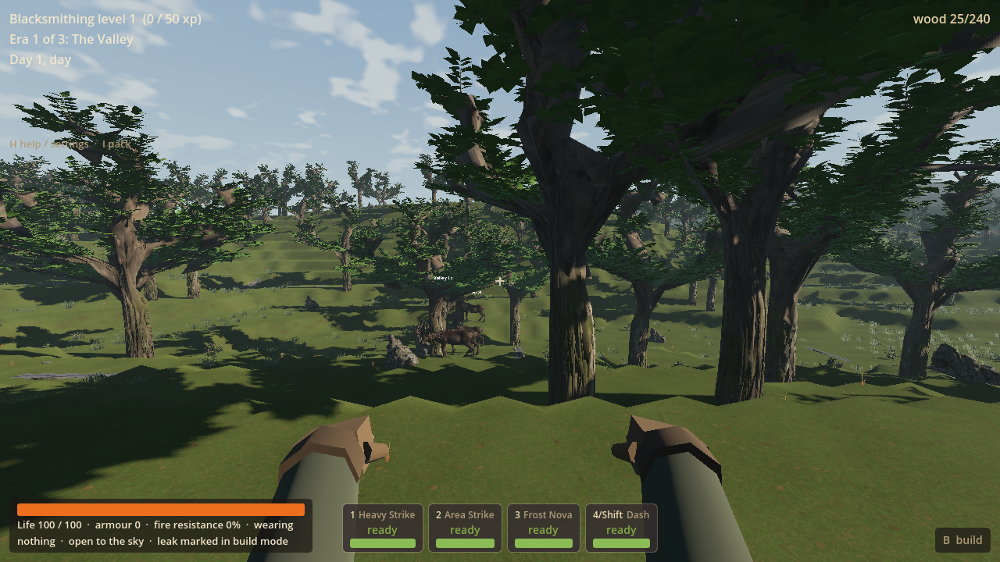
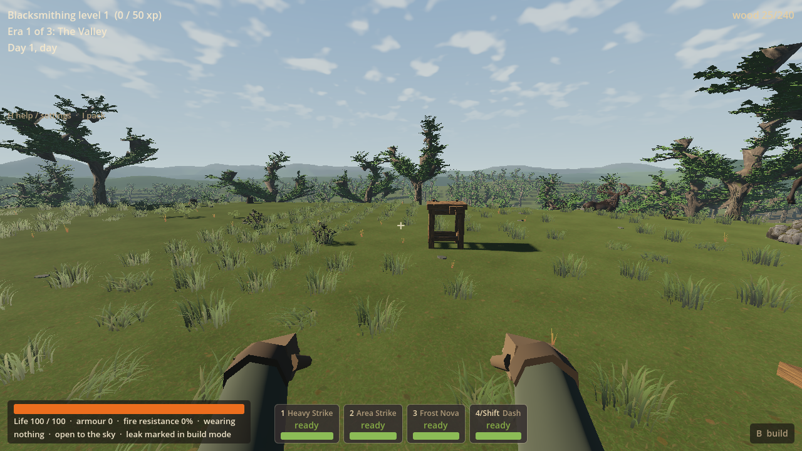
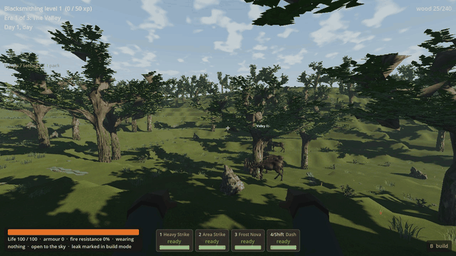

# RF-03 — landforms and places to make a home

RF-03 gives fresh normal worlds four practical home settings: a woodland pocket,
a meadow overlook, a bank-side terrace and a broader clearing. Rolling land,
enclosing banks and asymmetric extra level ground suggest entrances, courtyards,
workshops and future wings using the existing construction kit. Ordinary New
World now selects `frontier_v7`; existing saves and Living Frontier retain their
own geography, gameplay and ownership. Coordinator main integration is pending.

## Remaining limits

Owner playtesting and excitement/creativity remain deferred human feedback,
not a numeric pass. Two seeds have native coverage; only the seed-77 woodland-to-
overlook route has a daylight Forward+ walk. No impact is visible on that route;
the reshaped wildwood impact shoulder farther out is not captured. The terrace
and fourth home have native checks, not extra rendered tours. Fen/mountain keep
the established treatment. Grass remains clumped/patchy and adopted canopy art
is unchanged. Other lighting, all-seed coverage, full campaign play and hardware
cost remain unmeasured. PLAY-03 underground lag remains unresolved and parked;
R9 remains stopped.

## Implementation and tuning

V7 reads the separate `data/tuning/worldgen-frontier-v7.json`. Published
`worldgen.json` and all V1–V6/LF generator fragments are untouched. LF1/LF3 still
derive only from the V6 table; LF flags/policies and native default semantics
remain unchanged. Sandpit explicitly selects V7 for fresh random/chosen worlds.
Strict save validation restores saved profile/seed before generating, without a
schema migration. V7 opts into adopted art, RF01/RF02, existing bounded terrain/
resource/pack streaming and ordinary pressure ownership. LF-only rules stay exclusive.

The composer changes physical land before final resources, discoveries and
routes. It regrounds affected ordinary records, retains deep cave voids and the
existing finite content sequence. Four radius-14 level cores remain; seeded
angle/distance variation follows the existing wildwood direction. Asymmetric
skirts/extra ground replace radial pad edges. Existing finite pine frames a
woodland crescent, opening toward the valley. Low grass continues over V7 cores
until ordinary paid footprints clear it; V6/LF reservations stay exact. No plot
UI, stat bonus, free building, new material or construction rule is added.
Inherited local IDs such as `homev6_1` remain scoped by actual profile and seed.

New controls have explanations in the V7 file:

| Control | Value | Purpose |
| --- | --- | --- |
| Landform amplitude / wavelength | 5 m / 155 m | Broad grassy rises and dips. |
| Home distance / angle variation | ±8 m / ±0.16 radians | Vary locations around the seeded woodland direction. |
| Home blend / extension | 30 m / 10 m | Softer margins and extra level room on one side. |
| Bank height / overlook lift | 5 m / 5 m | Enclosure behind a home; a view above the valley. |
| Woodland radius / density | 62 m / 0.028 | Frame an opening with ordinary finite pine. |
| Wildwood impact shoulder | 3 m | Weather the surroundings of the existing old impact. |
| Approach smoothing | 3 m radius, two passes | Soften adjacent quantised steps before final placement. |

The 1,024 × 1,024 × 96 one-metre extent, 150 m quiet radius, 190 m hostile boundary,
night-three first eligible siege, and four trees/three boulders/two seams/one iron
source per home are retained.

## Sites and actual game media

| Seed 77 setting | Centre x/y/z | What the setting suggests |
| --- | --- | --- |
| Woodland pocket, `homev6_0` | 503 / 30 / 420 | A courtyard inside the wooded bank, workshop along its back, house entrance facing the open valley. |
| Meadow overlook, `homev6_1` | 607 / 39 / 508 | A west-facing veranda/deck, house behind, and a future side wing. |
| Bank terrace, `homev6_2` | 530 / 30 / 594 | A sheltered work area and longer yard/wing along the extra level ground; existing stairs can connect later extensions beyond the core. |
| Broader clearing, `homev6_3` | 415 / 32 / 509 | Multiple small buildings or a broader courtyard with shared circulation. |









These are engine viewport captures from the real player camera. The silent
640 × 360 clip contains 120 frames at 15 fps (eight seconds), at normal simulation
speed. Still images retain the original 1280 × 720 capture resolution.

## Checks actually run

[Compact verification receipt](rf03-evidence-2026-09-15/verification.json).
Three focused groups; no renderer/seed matrix, benchmark, campaign replay or reviewer.

| Group | Result |
| --- | --- |
| Native generation / identity | Seed 77, a reordered-definition repeat and seed 904 pass full-core, supply/work-route, supported-node, progression/rare/cave-route and hostile patrol-buffer checks. Final exact native fingerprints: `7390872050862452190` / `3356487179604358726`. Complete runtime maps at V6/77 and LF3/77 match the prepared baseline SHA256 records exactly. LF1's unchanged V6-derived inputs/routing are explicit; no LF1 replay. |
| Paid build / Continue | Final corrected-terrain build passes **31 checks**: finite tree work/pickups supply 42 wood; nine paid floor pieces include four octagonal corners, plus one ordinary crafted/placed workbench. Real floor movement, station use, grass clearance, local digging and save pass. Fresh-process V7 Continue passes **19 checks**, preserving exact ownership, depleted sources, drops, machines, dug cell, grass masks, movement and resave. A private V6 save also loads as V6 under the new default. Acquisition/placement are harness-paced, not a human gathering journey. |
| Ordinary Forward+ walk | **12 checks, zero failures**. **202.64 m**, 2,433 controller frames, two home settings and eight seconds of captured walking. Initial camera placement at the woodland home is explicit; no subsequent teleport or jump. Physics/world work/streaming stay active. Rendered grass clearance at the paid floor/station passes. Exit 0, no reported engine/shader errors; 97.23 s including startup and capture, not a benchmark. |

The first build fixture had an inferred-type parse error before assertions; it
was corrected. The initial walk stopped after 155.64 m on a steep terrain face
at `(569,511)`. A local headless collider diagnostic identified adjacent height
steps, not a tree or controller change. V7 margins now filter heights before
quantisation, protecting the 14 m cores. The affected native/build/Continue/walk
checks passed again; unchanged V6/LF evidence was reused. Initial failures remain
labelled in the receipt. No assertion or movement rule was weakened.

Headless import passed. Renderers held `Local\WroughtwildArtRender`, used BOM-free
no-focus overrides and asserted `--r8-no-mouse-capture`. Desktop input, remote
settings, owner saves and the C: DLL were untouched. All owned jobs ended and
overrides were removed. D: `build/rf03` holds private user/temp state, logs,
compilation and imports (`game/.godot` is its cache junction). Only selected media
and the short receipt are tracked; generated UID sidecars with retained sources
were removed. Final syntax/diff/link and source/DLL checks accompany the commit.

## Exact playtest

Run this user-invoked launcher for a separate ordinary save slot:

```powershell
& 'D:/Wroughtwild/work/rf03-landforms-homes/tools/wroughtwild-rf03/play.ps1'
```

1. Keep seed **77**, choose **Warden** for New World, then press **H** to confirm
   `frontier_v7`, seed 77. Existing class kits and gathering/build costs apply.
2. From spawn `(512,512)`, north is the initial forward direction. Walk about
   **92 m north and 9 m west** to the woodland pocket `(503,420)`.
3. Return toward spawn, then go about **95 m east and 4 m north** to the overlook
   `(607,508)`. Face west for the valley view. Native approaches bend around
   resources; ordinary walking needs no jump or movement skill.
4. Gather wood with **E**. **B → Tab** opens the building catalogue. Floor Slab
   and Triangular Slab make an octagonal footprint. **C** opens hand crafting for
   a Workbench Kit; place the kit using the existing palette, then use **E**.
   Dig a nearby soil cell away from the build and inspect grass clearance.
5. **F5** saves. Close, rerun the same launcher, then choose **Continue saved
   world / suspended trial**. Verify the same identity, build, harvested sources
   and dig. The launcher restores environment variables when it exits.

For the exact paid home fixture shown in the evidence:

```powershell
& 'D:/Wroughtwild/work/rf03-landforms-homes/tools/wroughtwild-rf03/play.ps1' -CheckedHome
```

Choose **Continue**. This copies the checked save once into another private slot,
never over an existing playtest save. Floor: `(606,39,498)`; bench: `(600,39,502)`.
It is a paid test fixture, not a free home in normal New World. After coordinator
integration, main's normal New World selects V7; existing Continue/LF launches
retain their saved geography and usual flags.

## Native handoff / publication

**Worker commit only; coordinator integration and push are pending.** The final
SHA is in the chat handoff and ignored native provenance record. Stop after RF-03.

DLL: `D:/Wroughtwild/work/rf03-landforms-homes/game/bin/libwroughtwild_sim.windows.x86_64.dll`

SHA256: `8d65d7331e445602c48e826cb5a1d280c24aae69b02a4c29f0ae3047ca3b65f2`

The linker output under `build/rf03/native/bin/` is byte-identical.
`tools/wroughtwild-rf03/build-native.ps1` and `CMakeLists.txt` build current worker
sources against only the existing Godot 4.5 ABI. `build/rf03/native/provenance.json`
records all **58 matching source/input hashes**, compiler, DLL hash and final
source revision. No native binary, dependency, import cache or full package is
committed. Coordinator adoption needs both the source commit and this exact DLL.
