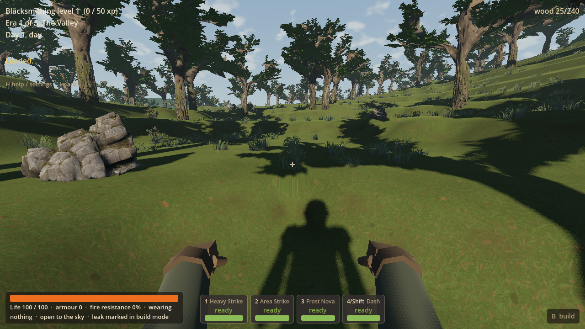
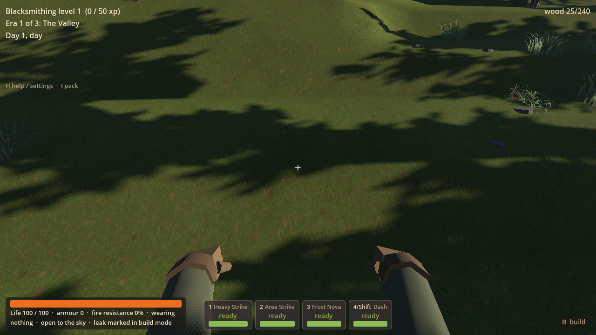
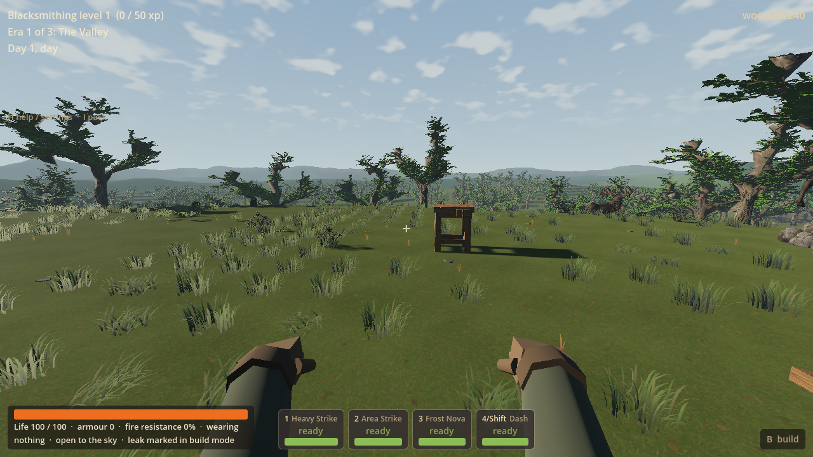
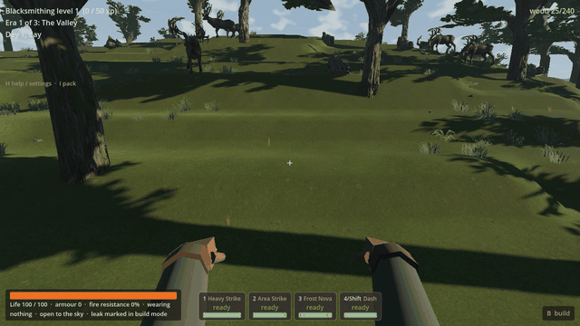

# RF-04 — natural ground continuity

RF-04 removes the extra face-centre peaks and hollows from V7's nearby ground,
so the meadow/woodland surface reads and walks more continuously. Broad hills,
all four RF-03 home settings, native saved geography and paid ownership remain.
Normal V7 New World and V7 Continue use the correction without a save migration.
Worker `5c421b3` is integrated on main as `27fc34d`. RF-05 has not started here.

## Mainline adoption

The coordinator installed the matching RF-04 DLL in the normal owner depot after
confirming no Godot process was running. The worker's focused geometry, contact,
Continue and Forward+ evidence below was reused. Main's one hidden headless import
passed in **6.76 seconds**, exit 0, engine exit 0 and zero reported errors.
Private logs/state are retained at
`D:/Wroughtwild/work/rf04-ground-continuity/build/rf04/main-integration`.
No coordinator test remains running. Worker import sidecars remain local and
are excluded from adoption; no native binary is committed. The ordinary source
push is reported separately in the coordinator handoff.

[RF-05 lakes and simple swimming](rf05-lakes-swimming-worker-2026-09-15.md) is
prepared next from this adopted surface correction. Owner feel remains deferred
feedback; the remaining steep-bank terracing below is not claimed resolved.

## Remaining limits

The native one-metre height quantisation and established side-face geometry
remain. Steeper banks still show terracing; this is a useful surface correction,
not a new height field or a claim that all waviness has disappeared. Smoother
native grades belong to a separately versioned fresh-world proposal, including
RF-05's lake successor, rather than retroactive V7 geography edits.

Only the seed-77 affected patch and paid overlook home have focused coverage.
Owner playtesting, broader campaign coverage, other lighting and hardware cost
remain deferred/unmeasured. RF-02's clumped grass and existing canopy limitations
remain. PLAY-03 underground lag is still unresolved and parked; R9 stays stopped.

## Cause and final implementation

The local sample is x=566–580, z=506–514, on the existing seed-77 meadow approach.
Native heights span 28–36 m. Of 135 upward source faces, **110** had their centre
away from the mean of their four averaged corners: up to **0.258 m** in 3D,
including **0.196 m vertically**. Pinning the fan centre to the original voxel
plane added peaks/hollows within individual faces. These were physical collision
features as well as visible geometry. RF-02 detail only perturbs lighting normals;
its shader does not displace vertices. No shader/material change is needed here.

`build_world_chunk` now places **V7 upward-facing source-face centres** at the
mean of their existing corners. The 135 measured centres have zero residual
against those corners after correction. The corners, native heights/blocks,
resource/site anchors, input tables, rules, profile identity and save schema stay
unchanged. V1–V6/LF and the cubic path retain their established geometry.

An initial attempt also averaged side-face centres. The short walk exposed a
new diagonal corner catch near `(558,26,512)`: the inherited DLL crossed it, while
the initial candidate stalled. The final implementation retains **side and
underside fans**, repairing that contact without controller changes or special
movement. The exact stopped-pose check now walks from x=557.744 to x=564.470 in
90 controller frames with ground contact.

The renderer, collision and `SurfaceSampler` share the same triangles. Existing
source-cell indices still select actual dug blocks; the same four-chunk halo
refreshes a corner dig. Existing resource regrounding, grass-root sampling and
paid-footprint masks consume the corrected surface. There is no new world scan,
streaming radius, gameplay rule, dependency or tuning parameter. This is an exact
geometric correction, so no blend-strength or smoothing-radius control is added.

## Focused checks

[Verification receipt](rf04-evidence-2026-09-15/verification.json) and
[retained cause patch](rf04-evidence-2026-09-15/cause-before.json).

| Focus | Actual evidence |
| --- | --- |
| Local cause / geometry / dig | **40 checks, zero failures** on the final DLL: native height/block digests match RF-03; the 135 top centres follow unchanged corners; renderer/collider triangles match; four chunks equal the same contiguous patch; actual ray picking, sampler contact, source-cell digging and exact restoration pass. |
| Private RF-03 paid-home Continue | **23 checks, zero failures**: exact saved native possessions/progression, nine paid octagonal floor pieces and one workbench, finite resource state, drops, machine/leyline ownership, retained excavation, floor movement, station use, resave, another local dig, sampled roots and CPU footprint masks. The flat-home evidence ran before restoring side/underside fans and is reused for unchanged home surfaces/ownership. Final local dig/contact checks and the rendered footprint assertion cover the changed side boundary. No new paid build/cost/generator suite was run. |
| Ordinary Forward+ walk | **12 checks, zero failures** on the final DLL: **60.32 m**, **723 controller frames**, three 1280×720 stills and **120 clip frames at 15 fps** (eight seconds at normal simulation speed). Same route and assertions as the failed walk; no jumps or subsequent teleports. Actual rendered grass/building clearance, active physics/world work, mouse-release and no-focus assertions pass. Engine exit 0, no reported errors; 93.50 seconds including startup/capture is not a benchmark. |
| Observed corner-catch follow-up | **2 checks, zero failures** on the final DLL. Only the concrete stopped contact was compared with the inherited runtime and repaired. No broader movement or performance investigation. |

Headless import passed in 38.34 seconds, engine exit 0 and no reported errors.
The native build uses the existing read-only Godot 4.5 ABI; compiler warnings in
those existing bindings remain, with no build error. Private state, import cache,
compilation, logs and raw captures stay under `build/rf04` on D:. Godot also
regenerated disposable sidecars/extracted embedded textures beside the D: source;
these remain local import outputs and are excluded from the source commit.

Two failed checks remain recorded: the first headless grass assertion read a
GPU MultiMesh buffer that the Dummy renderer does not retain; the corrected
check reads exact submitted CPU transforms/visibility flags. The first rendered
walk stalled at the new side-face contact and captured no clip. Only the affected
checks were repeated after their focused fixes; failures were not suppressed.

Rendered runs hold `Local\WroughtwildArtRender`, use a BOM-free no-focus override,
and assert `--r8-no-mouse-capture` plus the window's no-focus flag. No desktop
pointer automation is used. The owner depot DLL/saves and peer processes remain
untouched. No native binary, import cache or full package is committed.

## Selected actual game media

The final pictures and eight-second movement clip are engine viewport captures
from the ordinary first-person camera. The initial placement is explicit; the
route thereafter uses normal movement, active world work and collision.









## Ordinary New World / Continue playtest

For the integrated normal owner game:

```powershell
& 'C:/Users/Matty/Godot/Godot_v4.5-stable_win64_console.exe' --path 'C:/Users/Matty/Dev/project-wroughtwild/game' -- --world-seed=77
```

V7 **Continue** receives the surface correction on its existing geography. A
fresh **New World**, seed 77, offers the route below; the normal launcher uses
the owner's usual save slot. V1–V6/LF Continue retains its prior surface.

Use the worker's user-invoked launcher for an ordinary separate save slot:

```powershell
& 'D:/Wroughtwild/work/rf04-ground-continuity/tools/wroughtwild-rf04/play.ps1'
```

1. Keep seed **77**, choose **Warden** for New World and press **H** to confirm
   `frontier_v7`, seed 77. All ordinary class, gathering and construction rules apply.
2. From spawn `(512,512)`, head east toward the overlook `(607,508)`. The captured
   approach begins around `(555.5,511.5)` and crosses the measured patch near
   `(566–580,506–514)`. Look down while walking, then look back from the overlook
   to judge local continuity alongside the retained broad valley and banks.
3. The woodland pocket remains `(503,420)`, the bank terrace `(530,594)` and the
   fourth clearing `(415,509)`. Their native level cores are unchanged; these are
   optional playtest destinations, not additional rendered checks claimed here.
4. Gather with **E**; **B → Tab** opens construction. Existing Floor Slab and
   Triangular Slab make an octagonal footprint; **C** offers the Workbench Kit.
   Place/use the paid kit with the existing controls, and dig nearby soil away
   from the building to check the surface and grass response.
5. **F5** saves. Close and rerun the same launcher, then choose **Continue saved
   world / suspended trial**. Check the same build, station, resources and dig.

For the already-paid private RF-03 fixture:

```powershell
& 'D:/Wroughtwild/work/rf04-ground-continuity/tools/wroughtwild-rf04/play.ps1' -CheckedHome
```

Choose **Continue**. It copies the retained fixture once into a separate private
slot, never over an existing playtest save. Floor: `(606,39,498)`; workbench:
`(600,39,502)`. This is a paid test fixture, not a free home in a normal New World.
Ordinary owner-depot V7 Continue now gets the surface
correction; V1–V6/LF Continue retains its prior surface and geography.

## Native handoff and publication

The checked source and selected evidence are committed as `5c421b3` on
`codex/rf04-ground-continuity` and adopted on main as `27fc34d`, together with
this matching DLL:

`D:/Wroughtwild/work/rf04-ground-continuity/game/bin/libwroughtwild_sim.windows.x86_64.dll`

SHA256: `bcfb358028cfa1ac3c6a7269001a6d3451a47b73ba74ed1d3b9d622ef3a72700`

The linker output is at `build/rf04/native/bin/`.
`build/rf04/native/provenance.json` records **58 source/input hashes**, the compiler,
ABI, DLL hash and final matching source revision. The selected verification
receipt retains the native source/input hashes. The builder resolves sources
from this worker, uses incremental objects and never rebuilds/downloads the ABI.

Mainline adoption and owner-depot DLL replacement are complete. The coordinator
reports the ordinary push outcome separately. The RF-04 worker is finished.
