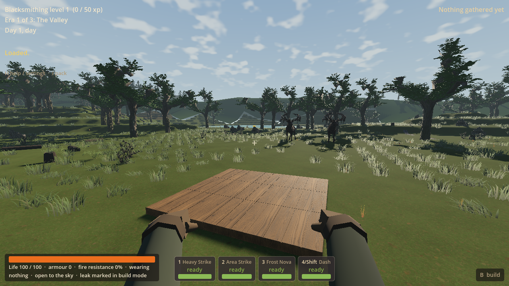
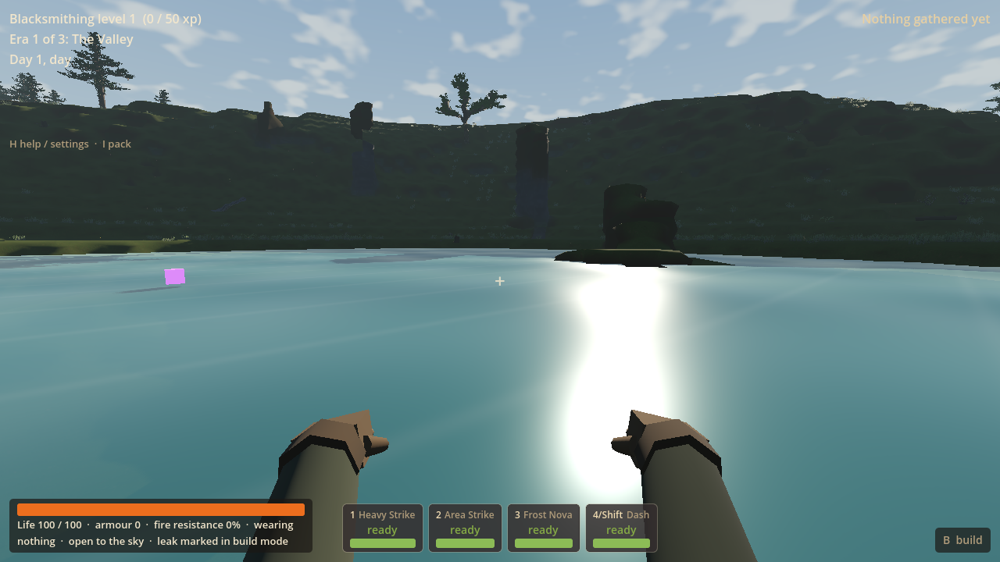
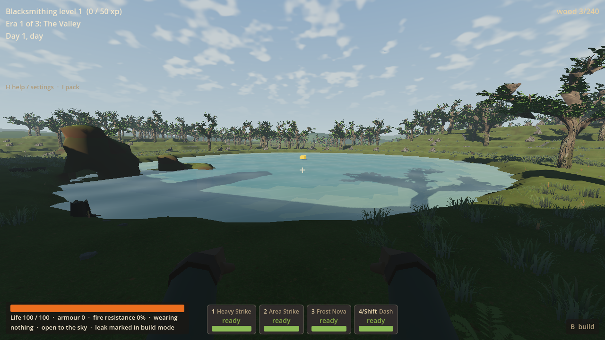
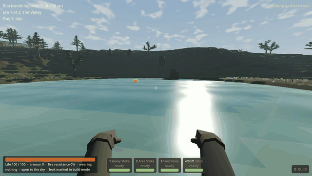

# RF-05 — a lake beside your next home

RF-05 puts one seeded lake into ordinary fresh V8 worlds, beside a dry buildable
home setting. You can walk through shallow water, swim at the surface with normal
movement input, and walk out onto shore. Paid drops and death packs float locally
and remain recoverable. Existing V1–V7/LF saves keep their geography and ownership.
Worker `c3867bf` is integrated on main as `5e5de06`; owner lake playtesting is deferred.

## Mainline adoption

The coordinator adopted the source and matching DLL below, preserving the newer
mob-hitch report and storage-retention update on main. No Godot process was
running during DLL replacement. The worker's 94 focused checks were reused;
main's one hidden headless import passed in **6.54 seconds**, exit 0, engine exit
0 and zero reported errors. This supplies a successful integrated editor import
without repeating the worker's scene checks. No coordinator test remains running.
Private logs/state are at
`D:/Wroughtwild/work/rf05-lakes-swimming/build/rf05/main-integration`.

The native DLL is installed locally and remains ignored, not committed. The
ordinary source push is reported separately in the coordinator handoff. Next is
the prepared [PLAY-03 mob-arrival worker](play03-mob-arrival-worker-2026-09-15.md),
addressing the owner's brief hitch when nearby mobs appear. It retains this lake
behavior; no lag fix or personal owner acceptance of the lake is claimed here.

## Remaining limits

- Water has a fixed generated footprint, level and original bed. Digging below or
  outside it stays dry; it does not drain, spread or simulate fluids. One-metre
  terracing and some angular water edges remain visible. Existing cave openings
  can leave uncarved banks/islands. No boats, diving, drowning meter or swim skill.
- This is surface support with the existing player art, not a new swimming
  animation production pass. Bright sun highlights and the existing grass/canopy
  finish remain prototype polish. Low bridge/enemy interactions, arbitrary seeds,
  other renderers/hardware and broader combat/campaign play are not exhaustively checked.
- Only seeds 77 and 78 have focused generation evidence. One daylight Forward+
  route was rendered. Owner feel/atmosphere acceptance and full performance impact
  remain unmeasured. PLAY-03 remains unresolved; its mob-arrival follow-up is now
  prepared from this adopted result. R9 stays stopped.

## What changed

Separate `worldgen-frontier-v8.json` and V8 composition retain the 1,024 × 1,024 ×
96 extent and existing broad RF-03 landforms. Lake siting uses a bounded seeded
search and four minimum-radius home fallbacks, protecting home cores, progression
sites and cave openings. Grading preserves cave voids below the new bed. Surface
resource eligibility follows home/lake regrounding, with final guaranteed supply
and discovery approaches composed on dry land. Terrestrial patrol segments avoid
water and ordinary enemy movement has a bounded shore guard.

All four radius-14 level home cores remain. Seed 77 has a lake near **(555,653)**,
level **29.4 m**, linked to the bank-terrace home **(530,30,594)**. Its generated
water footprint contains **1,529 cells**, including **370 shallow cells**. Seed 78
moves the lake to **(575,370)**, level **34.4 m**, beside another home. At least one
useful dry home outlook is linked to the lake without a free building or plot bonus.

`WorldMap.lakes` exposes compact original-bed records through the native map.
`LakeWater.column/contact` supplies the shared bounded query for surface meshes,
cover, movement and landing. Existing terrain edit hooks rebuild local water and
cover; solid terrain and paid physical support remain authoritative. The same
RF-04 upward-face correction, adopted assets/materials, streaming, normal pressure
and strict saved-profile validation explicitly include V8. LF-only systems stay
LF-only. Old generation inputs/composition are unchanged.

The existing capsule/controller supplies collision. Swimming settles its centre
0.05 m above water and leaves the camera about 0.77 m clear. Depth enters at 1.1 m
and exits below 0.85 m, with actual foot immersion of 1.0 m for entry / 0.8 m for
continued support. Horizontal swimming is 70% walk speed; existing haste, root,
dash and damage rules remain. Jump buffering, walking footsteps and landing dips
are suppressed afloat. New World, death, existing environment-reset boundaries
and Continue derive transient water state from the actual loaded world/pose.

Existing `Pickup`, `DroppedBundle` and `WorldDrops` own all items. Surface contact
changes no contents or age. Native solids and a short paid-body occlusion ray
prevent lifting loot through a roof. Exact saved sets restore before movement is
released. A real fresh-process failure exposed a cyclic death-pack PackedScene
preload; loading the existing scene when creating/restoring a pack fixes it.
No save schema, inventory owner, reward, material cost or progression rule is added.

## Tuning

All lake values and plain-language purposes are in
[`worldgen-frontier-v8.json`](../../data/tuning/worldgen-frontier-v8.json), under
`lake` / `design_purpose`:

| Controls | Values / player effect |
| --- | --- |
| Count / candidates | 1 lake; 32 candidate attempts plus four deterministic home fallbacks |
| Radius / aspect / variation | 28–36 m nominal radius; 0.82 aspect; restrained 0.035 shoreline variation |
| Depth / shore / blend | Approximately 4 m deep; 10 m shore shaping plus an 8 m bowl transition; 28 m dry grading |
| Home gap | 22 m of nominal dry expansion space beyond the protected home core |
| Swim enter / exit | 1.1 / 0.85 m depth hysteresis |
| Speed / support | 0.7 walk speed; centre offset +0.05 m; vertical response 8 per second |

## Focused verification

[Compact receipt and native input hashes](rf05-evidence-2026-09-15/verification.json).
Final focused results total **94 checks, zero failures**; earlier failed attempts
and their fixes remain recorded in the receipt and local logs.

| Focused job | Actual result |
| --- | --- |
| Generation / identity | **19/19**: seeds 77 and 78, independent native regeneration, one lake, shallow/deep water, four dry level cores and approaches, dry surface content and progression routes. Frozen V7/V6/LF input/composition diff guard is empty. |
| Retained old save, within identity job | **11/11**: one RF-04 V7 paid-home Continue, exact native possessions/progression, builds/station/resources/drops/excavation and dry support; no lake retrofit. |
| Connected water / ownership | **30/30**: actual finite wood gathering, nine paid home slabs, a **68.20 m** connected home-to-lake route, grounded wading and 342 swim frames with one entry transition, no jump popping/afloat footsteps, camera clearance, paid floating wood with unchanged age, actual death-pack creation and exact contents, afloat save, diggable bed and dry space below/outside its original volume. |
| Fresh-process Continue, within water job | **23/23**: exact saved identity/native and physical owners, surface pose, reachable death-pack recovery with duplicate-claim prevention, normal pickup attraction, opposite dry-shore exit, two-wood normal paid block placement in shallows and dry capsule support on it. |
| Ordinary Forward+ route | **11/11**: **100.13 m** through home, shore, wading, swimming and dry exit; 734 swim frames, 52 wade frames and two transitions. Three 1280×720 pictures and 120 frames at 15 fps, assembled as an eight-second clip. Ordinary player/world/streaming/mob physics stayed active. |

Final legacy and Forward+ runs used the delivered DLL. The last native rebuild
only preserved existing source line endings and added tuning explanations;
generation/water evidence is reused for unchanged executable logic and numeric
inputs. No renderer/seed matrix, performance gate, parent package rebuild or
broad regression wave was run. The initial editor import encountered a corrected
script indentation error; no final editor-import pass is claimed. All final scene
checks exited 0 with no reported engine errors.

The initial scripted straight route hit a finite boulder before water. The final
route uses ordinary sidesteps around that supply cluster; it does not remove the
boulders or teleport through them. An early Continue fixture also rounded JSON
floats and used the unpaid restore helper for its support block; it now compares
full-precision values and uses the normal paid placement action. The final route
ends on the reached dry bank. Assertions were not removed or weakened.

Capture uses `--r8-no-mouse-capture`, a BOM-free no-focus override, explicit mouse
and window-flag assertions, and `Local\WroughtwildArtRender`. No pointer automation
was used. Owned jobs are stopped. Build, imports, private saves, logs and raw
frames remain under this D: worker's `build/rf05` / `.godot`; no owner save or DLL
was overwritten. Generated import sidecars/extracted textures remain local and
are excluded from the source commit.

## Actual game pictures and motion

The rendered route has **one disclosed initial placement beside the paid home**.
Every following metre uses the normal controller and collision, including a
sidestep past boulders and past the floating recovery pack. The platform is a paid
test fixture, not a free structure in a normal New World.









## Playtest

For the integrated normal owner game:

```powershell
& 'C:/Users/Matty/Godot/Godot_v4.5-stable_win64_console.exe' --path 'C:/Users/Matty/Dev/project-wroughtwild/game' -- --world-seed=77
```

Choose **New World** for the lake route below; this uses the usual owner save slot.
Existing V1–V7/LF Continue preserves its geography and gains no retroactive lake.
Use the separate worker launcher below to retain your usual slot while trying V8.

For ordinary play in a separate private save slot:

```powershell
& 'D:/Wroughtwild/work/rf05-lakes-swimming/tools/wroughtwild-rf05/play.ps1'
```

1. Keep seed **77**, choose **Warden** for New World, and press **H** to confirm
   `frontier_v8`, seed 77. The normal class/opening/gathering rules apply.
2. From spawn `(512,512)`, head south-southeast toward the bank-terrace clearing
   `(530,594)`. The lake is farther southeast near `(555,653)`. The captured dry
   approach goes around the finite boulders via `(535,614)` and `(545,624)`.
3. Use normal **WASD** to walk into the shallows, keep going into deeper water,
   and head toward the opposite bank to walk out. The character automatically
   supports at the surface. Jump works again on grounded shore.
4. Gather with **E**. Use **B → Tab** for the existing building palette, and **C**
   for ordinary hand crafting. The dry 28 m-wide core and surrounding banks leave
   room for a house/workshop or lake outlook; pay for every piece normally.
5. **F5** saves, including while afloat. Close and rerun the same launcher, then
   choose **Continue saved world / suspended trial**. Check your position/build,
   any floating dropped wood and the same lake. Old V7/LF Continue retains its
   own geography and receives no retroactive lake.

For the already-paid private floor and afloat recovery fixture, run the same
launcher with **`-CheckedLake`**, then choose **Continue**. It copies the small
checked save once into another private slot and never overwrites an existing
playtest save. This shortcut is explicit fixture positioning, separate from the
normal new-world route above. Neither launcher changes the owner's save slot.

## Native handoff / publication

The checked source, tuning, tools and selected evidence are committed as
`c3867bf` on `codex/rf05-lakes-swimming` and adopted on main as `5e5de06` with the
matching native DLL. The private provenance identifies the original worker source.
The coordinator reports the ordinary push outcome separately.

Matching DLL:

`D:/Wroughtwild/work/rf05-lakes-swimming/game/bin/libwroughtwild_sim.windows.x86_64.dll`

SHA256: **`fbf7067477d63693e35b5d15ccff0bbad86be7586d679e284a44c843b0404e2b`**

The linker copy is in `build/rf05/native/bin/`. The ignored
`build/rf05/native/provenance.json` records **88 matching source/input hashes**,
the compiler, existing Godot 4.5 ABI and DLL hash. The selected verification
receipt retains those hashes. Build helpers resolve this worker's sources,
reuse the owner's read-only ABI and retain incremental objects. No native binary,
import cache, build folder or full package is committed.

RF-05 is complete and adopted. Its worker stopped without launching another slice.
The coordinator has prepared PLAY-03 mob arrival for the owner to start next.
