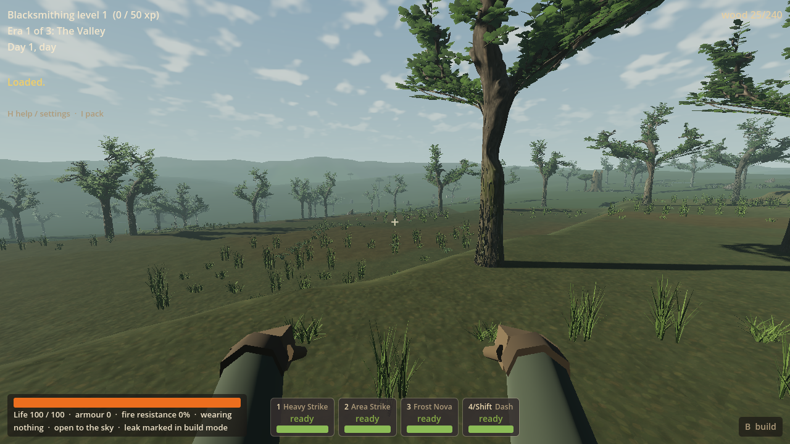
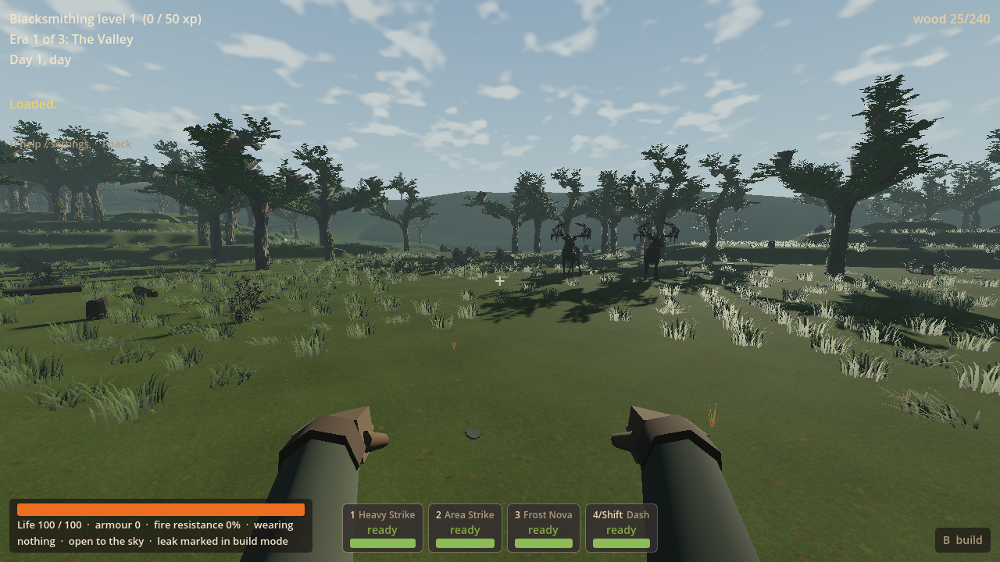
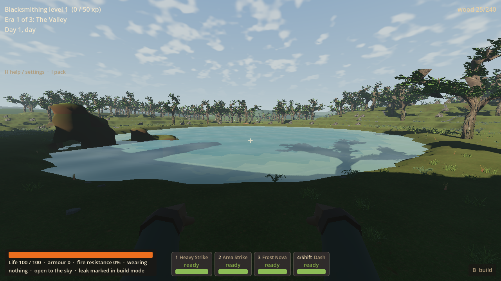

# RF-06: planted fen and open lakeside banks

RF-06 brings grouped low sedge, taller rush-like leaves, fern and occasional
deadfall into ordinary fen and lake-bank play. Subdued damp litter joins the
plants to the existing ground. Open water, the dry lake-home approach and usable
building space remain. This advances the original Reclaimed Frontier wetland
outcome; it adds no terrain, water or gameplay rules.

The finish remains sparse in places, especially exposed terraces; bank edges are
still angular, deep tree shade obscures some plants, and bright water glare is
visible. These are recorded for end-of-wave cleanup, not claimed solved.
At worker handoff, owner playtesting was deferred. On 16 September the owner
subsequently called the result "definitely underwhelming" and suggested a later
image-to-3D/Blender intensive. The coordinator agrees from four retained gameplay
screenshots: sparse isolated clumps and weak ground/bank transitions do not yet
create convincing wetland identity. Existing tree silhouettes, broad ground and
shore geometry still dominate. No live coordinator playtest is claimed.

The usable placement foundation is adopted, but the intended atmosphere remains
an open outcome. This is not an aesthetic sign-off. A later art/composition
intensive is a proposal; highland recovery remains the next original slice.

## Coordinator adoption, 16 September

Implementation is on main as `12238ce`, worker handoff as `710a3c6`, from
`928fb4c` / `5785711`. Worker placement 32/32, Continue 16/16 and Forward+ route
12/12 evidence was reused. Main's hidden headless import passed in 4.91 seconds,
exit 0, zero reported errors. No game source changed during adoption. Native DLL
unchanged; all owned checks ended. Publication is recorded by the coordinator's
Git handoff. The worker publication section below describes its historical handoff.

## Checked branch and publication

- Workspace: `D:/Wroughtwild/work/rf06-fen-lakeside`.
- Branch: `codex/rf06-fen-lakeside`.
- Base: `c5ceb9fef46d13e413f98cf9b8ed5f05e32f7fb2`.
- Checked implementation/media commit: **`928fb4c8c62809bc5600807f81329d33fae71481`**.
- The subsequent documentation commit records this result and cleanup notes;
  its SHA is returned in the worker handoff.
- Local commits only. **No main integration or remote push was performed.**
  The owner brief assigns adoption and main publication to the coordinator.
- Reuse the inherited RF-05 DLL; no native source/build change or new package.
  SETUP's inherited SHA256 is
  `fbf7067477d63693e35b5d15ccff0bbad86be7586d679e284a44c843b0404e2b`.

## Compatibility and implementation

[RF-06 cover](../../game/rf06/cover.gd) is installed at the existing world-loading
boundary alongside RF-01. It caches four small compositions from the adopted
`strange_sedge`, `fern_bed` and `deadfall` meshes. Decorative rush leaves have no
harvestable seed heads. Existing editable masters and runtime sources remain;
no new art catalogue or third-party dependency was needed.

- Weathered V6/V7/V8 and existing LF1/LF3 profiles receive fen dressing on
  existing marsh/grass/forest-floor surfaces. V1–V5 keep their existing path.
- Lake-margin eligibility comes from actual RF-05 bed/level records. A bounded
  dry-bank distance index is derived once at world entry. No new water columns,
  swimming contacts, bed edits, map fields or saved state are created.
- Meadow/forest changes are confined to suitable dry lake-bank cells; other
  biomes are excluded. A non-lake fen uses its existing ground without any
  generated water. Historical decorative shallow pools are retained unchanged.
- Each root and its footprint use RF-01's actual triangle support checks,
  original surface height, native approach/resource reservations and local chunk
  lifetime. No plant is anchored in water, a hole or a cave floor. Cosmetic
  meshes have no collision. Existing regional roots/pools are indexed to avoid
  doubled placement; old low ground/habitat cover is replaced in eligible cells.
- Paid floors (including octagonal parts), stations and work margins reuse the
  existing building-suppression hooks. Placement never owns a resource or piece.
- The ground shader uses exact eligibility and original top-height masks,
  existing RF-02 litter texture/scale, restrained colour blending and matte
  roughness. It changes neither vertices nor RF-04 continuity/collision.
- Continue and LF terrain publication rebuild through the existing validated
  restore/world path. The mask and reservations derive anew from that actual
  map. Unchanged LF publication/save evidence is reused; no campaign replay.
- Recent creature/scenery preparation paths are unchanged. Small new meshes and
  the shared litter texture are prepared during entry, not loaded on plant
  arrivals. No per-frame world scan or ecology simulation is introduced.

## Presentation controls

[settings.json](../../game/rf06/settings.json) explains the principal controls:

| Control | Current effect |
| --- | --- |
| Patch scale | 11 m groups with quiet gaps, tied to saved seed/profile |
| Coverage | 10% in openings through 78% in patch hearts |
| Dry bank | Up to 7 m from actual water, at most 3 m above its level |
| Taller growth | Inner 3 m of bank or fen patch hearts; 46% share there |
| Plant envelope | 0.68 m width; low sedge 0.29 m, tall leaves 0.86 m |
| Variation | 72–100% scale; outer bank also fades down toward ordinary grass |
| Home outlook | No tall growth within 11 m of an existing home centre; no plot boundary |
| Ground blend | 42% maximum damp-litter blend; same 2.4 m texture scale |

Minor composition selections remain in the scoped module: fern on the upper
17% of the role roll, deadfall only in dense patch hearts on its upper 1.4%,
0.18 m deadfall height, and broad patch thresholds. These are cosmetic recipe
choices, not native terrain or game tuning. RF-01's existing support tolerance,
root embedding, approach reservations and cover distance remain authoritative.

## Focused verification actually run

Risks: obstructed lake access, unsupported plants, duplicate roots, paid-building
overlap, cross-biome spill, and changed state on Continue. One renderer, three
focused jobs; no benchmark matrix, native rebuild, second renderer or full replay.

| Job | Result |
| --- | --- |
| One hidden first import | Exit 0; 36.5 s; no reported engine/script errors |
| Placement/use | **32/32**, 51.4 s: actual fen + bank roots, approach/dry checks, chunk retirement/rebuild, excavation/restoration, paid octagonal floor + workbench use, partial source work, unchanged terrain/water, non-lake V6 context |
| Fresh-process Continue | **16/16**, 63.38 s: exact native state, structures/stations, finite sources, drops, terrain/lakes and repeated cover/clearing; normal movement, lake contact and resave |
| Forward+ presentation/use | **12/12**, 98.53 s: 103.63 m normal controller route, 734 swimming and 52 wading frames, dry exit, active world/mob systems and retained comfort flags |

The first placement attempt had three fixture failures: moving focus to the
distant fen retired the lake chunks, making the two-location snapshot invalid.
The corrected fixture builds only its selected chunks without changing streaming
policy. That focused job was rerun after adding existing-region exclusions and
passed. No assertion was removed or weakened. This is not a game streaming fix.

The actual fixture contains 398 fen and 146 bank plants before its paid-building
clearance. Counts describe these selected chunks, not a density/performance survey.
Paid octagonal floor origin: `(543,30,626)`; station: `(533,30,634)`.

The evidence JSON files are beside the images. Full stdout/stderr and private
fixtures remain under `build/rf06/`. PowerShell launcher syntax and Git whitespace
checks passed. All owned Godot processes ended; the temporary no-focus override
was removed. Owner interactive play was not launched. First-import sidecars and extracted embedded
textures remain local/uncommitted alongside the reused cache; they are not source
changes or a packaged release.

## Actual game pictures and clip

Unmodified 1280×720 Forward+ viewport captures, normal HUD/player camera:





[Second fen view](rf06-evidence-2026-09-16/02-fen-opening.png),
[surface swimming](rf06-evidence-2026-09-16/04-water-and-bank.png), and
[eight-second silent shore/swim clip](rf06-evidence-2026-09-16/shore-walk.gif).
The clip uses 120 actual viewport frames at 15 fps, reduced to 640×360 for sharing.
No generated mockup, synthetic scenery or edited screenshot is presented as play.

Staging is explicit: the private paid world loads normally; first the player is
placed at existing fen `(336.5,33.1,680.5)`, walks 4 m, then is placed beside the
dry lake home `(528.957,31.1,590.810)`. The subsequent home → shore → swim → dry
exit is connected normal-controller movement. The scene stays in ordinary V8,
seed 77, with world, terrain, mobs and player systems active. Initial staging is
not counted as walking distance. No journey between fen and lake is claimed.

## Exact private playtest

From any PowerShell window, run:

```powershell
powershell -NoProfile -ExecutionPolicy Bypass -File "D:/Wroughtwild/work/rf06-fen-lakeside/tools/wroughtwild-rf06/play.ps1"
```

1. Choose **Continue saved world / suspended trial**. This opens seed **77**,
   **frontier_v8**, on dry ground beside home `(530,594)`, facing toward the lake.
2. Walk forward toward the water and around the finite boulders. The checked
   route passes `(535,614)` then `(545,624)`; the lake is near `(555,653)`.
   Coordinates are replay documentation, not a requirement to use the parked UI.
   Look for broken low/tall planting along the dry banks and open water between.
3. Wade in, swim across and walk out. Look back at the planted bank and dry home
   space. Use ordinary **B** construction and **E** station interaction; payment
   is unchanged. The checked paid floor and bench are on the approach side.
4. **F5** saves private progress. Close and launch again to Continue it. **H**
   shows controls and seed/profile. The usual movement/bindings remain active.

For the existing fen setting, use a separate private slot:

```powershell
powershell -NoProfile -ExecutionPolicy Bypass -File "D:/Wroughtwild/work/rf06-fen-lakeside/tools/wroughtwild-rf06/play.ps1" -Fen
```

Choose Continue. The first launch stages the same owned world at
`(336.5,33.1,680.5)`, facing west; walk between sedge/rush groups and inspect the
existing marsh ground. Normal hostile creatures remain active. No water is added
to this fen setting. Add `-Fresh` instead to choose a class for a fresh seed-77
world in a third private slot.

Each slot is independent and is populated only if it has no save:

`build/rf06/playtest-lake/user/Godot/app_userdata/Wroughtwild/wroughtwild_save.json`

`build/rf06/playtest-fen/user/Godot/app_userdata/Wroughtwild/wroughtwild_save.json`

`build/rf06/playtest-new/user/Godot/app_userdata/Wroughtwild/wroughtwild_save.json`

The launcher preserves existing private progress and ordinary owner saves. Its
Bypass applies to that PowerShell process only. It does not change global policy,
remote-access tooling, controls or automatic mouse capture in normal play.

## Remaining original work and deferred additions

Next original outcome is **highland recovery**, then remaining reclaimed-impact/
living-scar composition, then one bounded cleanup slice. This worker stops here;
none of those tasks or the parked compass work was started.

RF-06 cleanup observations: sparse planting/visible gaps on some fen terraces;
bank planting can disappear into strong tree shade; water glare limits the
swimming view; angular shoreline remains. Recommend deferral so the next highland
slice stays on schedule. Current cover is static authored leaf geometry with no
new wetland-specific wind animation. Further visual richness is a later iteration.

Existing short group-frame hitch, Thrumroot construction, long entry time,
unassigned lag/underground correlation and dedicated swimming animation remain
open with their previous evidence. This slice establishes neither hitch-free
play nor minimum-hardware performance. Full LF/campaign, all seeds, other
renderers and owner aesthetic/comfort acceptance were not newly verified.
